# Kumbh Monitor Intelligence Platform — Database Architecture

> **Version:** 1.0.0
> **Date:** 2026-06-30
> **Status:** Blueprint — Awaiting SQL Generation Phase
> **Author:** Principal Database Architect

---

## Table of Contents

1. [Design Philosophy](#1-design-philosophy)
2. [Naming Conventions & Standards](#2-naming-conventions--standards)
3. [Global Entity Relationship Overview](#3-global-entity-relationship-overview)
4. [Module 1 — Source Management](#module-1--source-management)
5. [Module 2 — Raw Content](#module-2--raw-content)
6. [Module 3 — Normalized Documents](#module-3--normalized-documents)
7. [Module 4 — Event Resolution](#module-4--event-resolution)
8. [Module 5 — Taxonomy](#module-5--taxonomy)
9. [Module 6 — Entities](#module-6--entities)
10. [Module 7 — Geography](#module-7--geography)
11. [Module 8 — Keywords](#module-8--keywords)
12. [Module 9 — Classification Results](#module-9--classification-results)
13. [Module 10 — AI Operations](#module-10--ai-operations)
14. [Module 11 — Knowledge Graph Preparation](#module-11--knowledge-graph-preparation)
15. [Module 12 — Analytics](#module-12--analytics)
16. [Indexing Strategy](#indexing-strategy)
17. [Partitioning Strategy](#partitioning-strategy)
18. [Caching Strategy](#caching-strategy)
19. [Storage Strategy](#storage-strategy)
20. [Database Evolution](#database-evolution)

---

## 1. Design Philosophy

### 1.1 Highly Normalized

Every piece of information lives in exactly one place. Lookup tables separate reference data from transactional data. Junction tables manage many-to-many relationships. Denormalization is applied *only* to pre-computed analytics tables and materialized views, never to source-of-truth tables.

**Normalization targets:**

| Data Category | Normal Form | Rationale |
|---|---|---|
| Lookup / Reference | 3NF | Stable, small, queried by FK |
| Transactional | 3NF–BCNF | Integrity over speed |
| Junction / Mapping | 3NF | Clean M:N resolution |
| Analytics / Statistics | Intentional 1NF–2NF | Pre-aggregated for dashboard speed |
| Materialized Views | Denormalized | Read-only projections refreshed on schedule |

### 1.2 Version Everything

Every entity that can change over time carries a versioning strategy:

- **Immutable append:** Create a new version row; mark the old version as `is_current = FALSE`. The original row is never mutated.
- **Versioned entities:** `taxonomy_version`, `prompt_template_version`, `keyword_version`, `source_configuration` (with version column), `classification_version`, `document_version`.
- **Version numbering:** Monotonically increasing integers scoped to the parent entity. `UNIQUE(parent_id, version_number)` prevents collisions.

### 1.3 Never Delete

No `DELETE` statement should ever execute against a production table.

- Every table carries `is_deleted BOOLEAN NOT NULL DEFAULT FALSE`.
- Tables with delete semantics also carry `deleted_at TIMESTAMPTZ` and `deleted_by UUID`.
- All queries filter on `is_deleted = FALSE` by default (enforced at the application layer or via row-level security policies).
- Exceptions: high-volume log tables (`fetch_log`, `ai_request_log`) may use time-based partitioning with `DROP PARTITION` after archival to object storage.

### 1.4 Audit Trail

Every row tracks its origin:

| Column | Type | Purpose |
|---|---|---|
| `created_at` | `TIMESTAMPTZ NOT NULL DEFAULT NOW()` | When the row was created |
| `updated_at` | `TIMESTAMPTZ NOT NULL DEFAULT NOW()` | When the row was last modified |
| `created_by` | `UUID` | Who/what created the row |
| `updated_by` | `UUID` | Who/what last modified the row |

Log and analytics tables omit `updated_at`/`updated_by` because they are insert-only.

### 1.5 Future-Proof Extensibility

- **JSONB columns** (`metadata`, `properties`, `config_data`) on entities that may accrue semi-structured attributes over time — avoids ALTER TABLE for every new field.
- **Lookup tables with SMALLSERIAL PKs** for type enumerations — new types are inserted, not schema changes.
- **Knowledge Graph preparation tables** (Module 11) designed now so the graph can be built without migrating existing data.
- **Embedding-ready columns** can be added later as `VECTOR(n)` columns (via pgvector) without redesigning the document or entity tables.

---

## 2. Naming Conventions & Standards

### 2.1 Table Names

- `snake_case`, singular noun: `document`, `entity`, `event`, `source`.
- Junction tables: `{table_a}_{table_b}` ordered by domain precedence: `document_author`, `document_event`.
- Lookup tables: suffixed with `_lookup` when ambiguity exists: `event_status_lookup`, `event_type_lookup`.
- Version tables: suffixed with `_version`: `document_version`, `taxonomy_version`.
- Statistics tables: prefixed with `stat_`: `stat_daily_summary`, `stat_source_daily`.

### 2.2 Column Names

- `snake_case`, no table prefix unless needed for clarity.
- Primary key: `id`.
- Foreign key: `{referenced_table}_id` (e.g., `source_id`, `document_id`).
- Booleans: prefixed with `is_` or `has_`: `is_deleted`, `is_active`, `has_media`.
- Timestamps: suffixed with `_at`: `created_at`, `published_at`, `fetched_at`.
- Dates (no time): suffixed with `_date`: `stat_date`, `usage_date`.

### 2.3 Primary Key Types

| Category | PK Type | Rationale |
|---|---|---|
| Core entities (document, event, entity, source) | `UUID` | Globally unique, merge-safe, distributed-friendly, KG-compatible |
| Lookup tables | `SMALLSERIAL` or `SERIAL` | Small cardinality, efficient joins, memory-friendly |
| High-volume logs & junction tables | `BIGSERIAL` | Auto-increment, compact, partition-compatible |
| Version tables | `SERIAL` or `BIGSERIAL` | Sequential, scoped uniqueness via compound unique constraint |

### 2.4 Index Names

- `idx_{table}_{column(s)}` for regular indexes.
- `uq_{table}_{column(s)}` for unique constraints.
- `idx_{table}_{column(s)}_gin` for GIN indexes (JSONB, full-text).
- `idx_{table}_{column(s)}_gist` for GiST indexes (geospatial).

### 2.5 Schema Organization

All tables live in the `public` schema for simplicity. If schema-based multi-tenancy is added later, modules map naturally to schemas:

| Schema | Modules |
|---|---|
| `source` | 1 |
| `content` | 2, 3 |
| `intelligence` | 4, 5, 6, 9 |
| `geo` | 7 |
| `keyword` | 8 |
| `ai` | 10 |
| `graph` | 11 |
| `analytics` | 12 |

---

## 3. Global Entity Relationship Overview

The following diagram shows how the 12 modules connect at the highest level. Each module is detailed in its own section below.

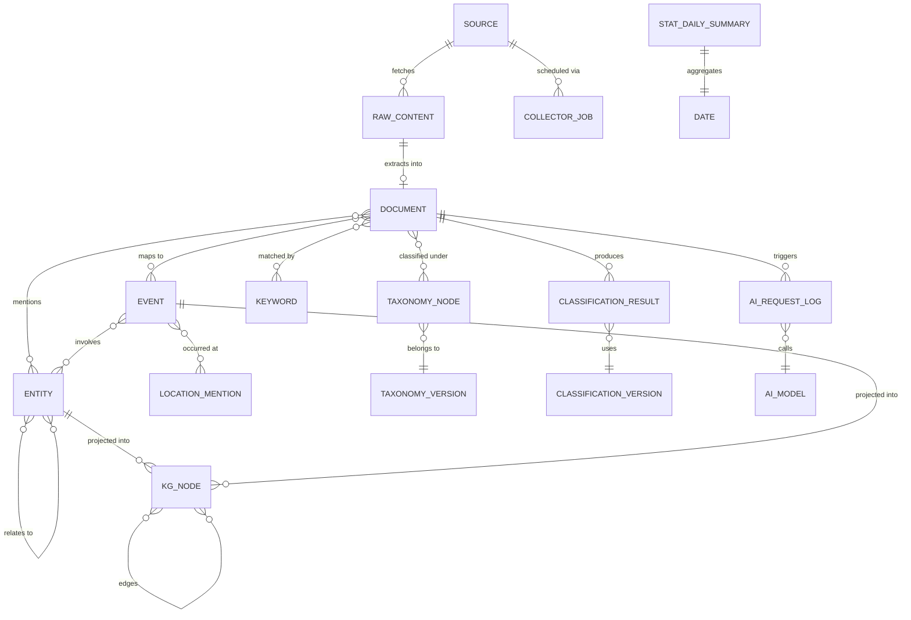

### Data Flow Summary

```
Sources → Collector Jobs → Raw Content → Extraction → Documents
                                                          ↓
                                            ┌─────────────┼─────────────┐
                                            ↓             ↓             ↓
                                        Entity NER    Taxonomy     Event Detection
                                            ↓         Classification     ↓
                                        Entities          ↓          Events
                                            ↓        Classification      ↓
                                            ↓         Results           ↓
                                            └─────────────┼─────────────┘
                                                          ↓
                                                    Knowledge Graph
                                                          ↓
                                                      Analytics
```

---

## Module 1 — Source Management

### Purpose

Track every information source the platform monitors — news websites, RSS feeds, government portals, social media accounts, APIs. Manage their configurations, credentials, health, and collection schedules with full history.

### ER Diagram

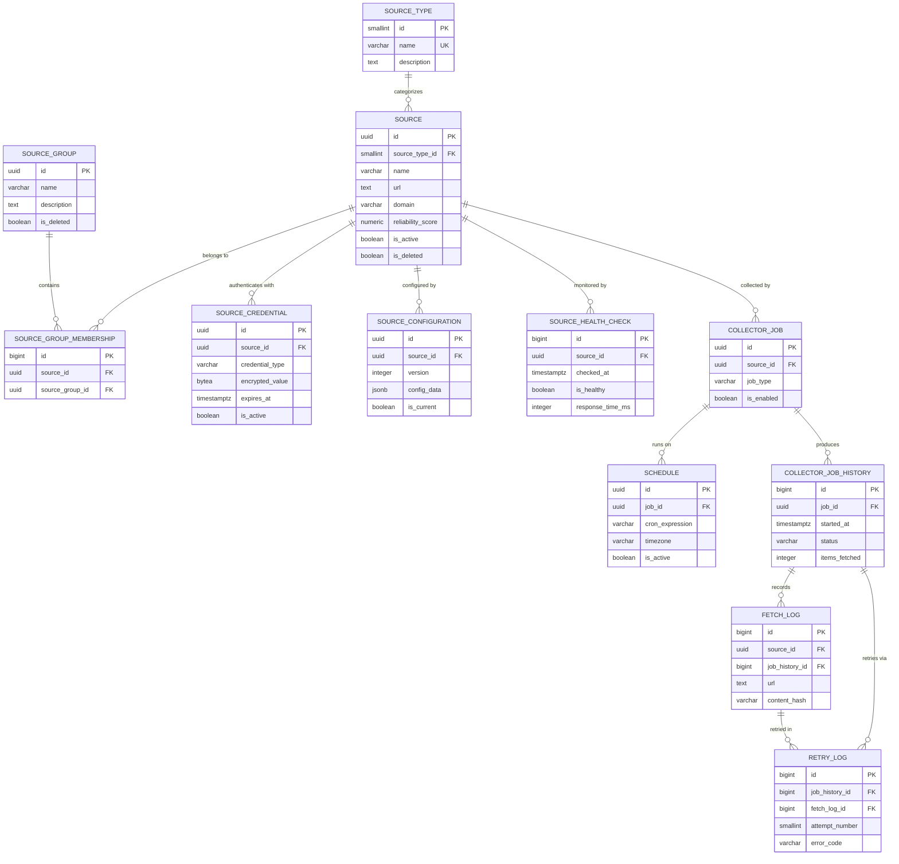

### Table Definitions

---

#### `source_type`

**Purpose:** Lookup table categorizing sources (newspaper, news_agency, government, social_media, blog, wire_service, television, radio, press_release_portal).

| Column | Type | Nullable | Default | Notes |
|---|---|---|---|---|
| `id` | SMALLSERIAL | NO | auto | PK |
| `name` | VARCHAR(50) | NO | — | UNIQUE. Enum-like stable values |
| `description` | TEXT | YES | — | Human-readable explanation |
| `is_deleted` | BOOLEAN | NO | FALSE | Soft delete |
| `deleted_at` | TIMESTAMPTZ | YES | — | When soft-deleted |
| `created_at` | TIMESTAMPTZ | NO | NOW() | Row creation |
| `updated_at` | TIMESTAMPTZ | NO | NOW() | Last modification |

**PK:** `id`
**Unique:** `uq_source_type_name` on `(name)`
**Indexes:** None additional — small table, PK index suffices.

---

#### `source`

**Purpose:** Every monitored information source. The central entity of Module 1.

| Column | Type | Nullable | Default | Notes |
|---|---|---|---|---|
| `id` | UUID | NO | gen_random_uuid() | PK |
| `source_type_id` | SMALLINT | NO | — | FK → source_type |
| `name` | VARCHAR(255) | NO | — | Human name (e.g., "Times of India") |
| `url` | TEXT | YES | — | Base URL |
| `domain` | VARCHAR(255) | YES | — | Extracted domain for grouping |
| `country_id` | SMALLINT | YES | — | FK → country (Module 7) |
| `language_id` | SMALLINT | YES | — | FK → language (Module 3) |
| `reliability_score` | NUMERIC(3,2) | YES | — | 0.00–1.00 editorial trust score |
| `is_active` | BOOLEAN | NO | TRUE | Whether currently collecting |
| `metadata` | JSONB | YES | — | Extensible attributes |
| `is_deleted` | BOOLEAN | NO | FALSE | Soft delete |
| `deleted_at` | TIMESTAMPTZ | YES | — | — |
| `created_at` | TIMESTAMPTZ | NO | NOW() | — |
| `updated_at` | TIMESTAMPTZ | NO | NOW() | — |
| `created_by` | UUID | YES | — | — |
| `updated_by` | UUID | YES | — | — |

**PK:** `id`
**FK:** `source_type_id` → `source_type(id)`, `country_id` → `country(id)`, `language_id` → `language(id)`
**Indexes:**
- `idx_source_type_id` on `(source_type_id)` — filter by type
- `idx_source_domain` on `(domain)` — group by domain
- `idx_source_is_active` on `(is_active) WHERE is_deleted = FALSE` — partial index for active sources
- `idx_source_country_id` on `(country_id)` — filter by country

**Relationship explanations:**
- **source → source_type** (M:1): Every source has exactly one type. Type is a lookup. Allows filtering all "newspaper" sources efficiently.
- **source → country** (M:1, optional): A source may be associated with a home country. Optional because some sources are international.
- **source → language** (M:1, optional): Primary language of the source. Optional because some sources are multi-lingual.

---

#### `source_group`

**Purpose:** Logical groupings of sources (e.g., "Hindi News", "Government Sources", "International Wire Services"). Used for batch operations and dashboard filtering.

| Column | Type | Nullable | Default | Notes |
|---|---|---|---|---|
| `id` | UUID | NO | gen_random_uuid() | PK |
| `name` | VARCHAR(255) | NO | — | Group name |
| `description` | TEXT | YES | — | — |
| `is_deleted` | BOOLEAN | NO | FALSE | — |
| `deleted_at` | TIMESTAMPTZ | YES | — | — |
| `created_at` | TIMESTAMPTZ | NO | NOW() | — |
| `updated_at` | TIMESTAMPTZ | NO | NOW() | — |

**PK:** `id`
**Unique:** `uq_source_group_name` on `(name) WHERE is_deleted = FALSE`

---

#### `source_group_membership`

**Purpose:** M:N junction between sources and groups. A source can belong to multiple groups, and a group contains multiple sources.

| Column | Type | Nullable | Default | Notes |
|---|---|---|---|---|
| `id` | BIGSERIAL | NO | auto | PK |
| `source_id` | UUID | NO | — | FK → source |
| `source_group_id` | UUID | NO | — | FK → source_group |
| `added_at` | TIMESTAMPTZ | NO | NOW() | When added to group |

**PK:** `id`
**FK:** `source_id` → `source(id)`, `source_group_id` → `source_group(id)`
**Unique:** `uq_source_group_membership` on `(source_id, source_group_id)`
**Indexes:**
- `idx_sgm_source_id` on `(source_id)`
- `idx_sgm_group_id` on `(source_group_id)`

**Why this exists:** A dedicated junction table instead of a JSONB array because: (a) referential integrity via FK, (b) efficient querying in both directions, (c) can carry metadata like `added_at`.

---

#### `source_credential`

**Purpose:** Encrypted credentials for sources that require authentication (API keys, OAuth tokens, cookies).

| Column | Type | Nullable | Default | Notes |
|---|---|---|---|---|
| `id` | UUID | NO | gen_random_uuid() | PK |
| `source_id` | UUID | NO | — | FK → source |
| `credential_type` | VARCHAR(50) | NO | — | api_key, oauth2, basic_auth, cookie, bearer_token |
| `encrypted_value` | BYTEA | NO | — | Application-level encryption |
| `expires_at` | TIMESTAMPTZ | YES | — | Credential expiry |
| `is_active` | BOOLEAN | NO | TRUE | — |
| `is_deleted` | BOOLEAN | NO | FALSE | — |
| `created_at` | TIMESTAMPTZ | NO | NOW() | — |
| `updated_at` | TIMESTAMPTZ | NO | NOW() | — |

**PK:** `id`
**FK:** `source_id` → `source(id)`
**Indexes:** `idx_source_credential_source_id` on `(source_id)`

**Why this exists:** Credentials are separated from `source` because: (a) a source may have zero, one, or multiple credentials (e.g., rotating API keys), (b) credentials have their own lifecycle (expiry, rotation), (c) security — credential data is isolated for access control.

---

#### `source_configuration`

**Purpose:** Versioned configuration for how to collect from a source (selectors, pagination rules, rate limits, custom headers). Each change creates a new version row.

| Column | Type | Nullable | Default | Notes |
|---|---|---|---|---|
| `id` | UUID | NO | gen_random_uuid() | PK |
| `source_id` | UUID | NO | — | FK → source |
| `version` | INTEGER | NO | — | Monotonically increasing per source |
| `config_data` | JSONB | NO | — | Full configuration snapshot |
| `is_current` | BOOLEAN | NO | FALSE | Only one per source |
| `activated_at` | TIMESTAMPTZ | YES | — | When this version went live |
| `deactivated_at` | TIMESTAMPTZ | YES | — | When replaced by newer version |
| `change_notes` | TEXT | YES | — | Why this version was created |
| `is_deleted` | BOOLEAN | NO | FALSE | — |
| `created_at` | TIMESTAMPTZ | NO | NOW() | — |
| `created_by` | UUID | YES | — | — |

**PK:** `id`
**FK:** `source_id` → `source(id)`
**Unique:** `uq_source_config_version` on `(source_id, version)`
**Indexes:**
- `idx_source_config_current` on `(source_id) WHERE is_current = TRUE AND is_deleted = FALSE` — fast lookup of active config

**Why versioned:** Configurations change when a website redesigns its layout, changes its API, or requires different parsing rules. Keeping all versions allows rollback and audit of what configuration was active when a specific article was collected.

---

#### `source_health_check`

**Purpose:** Log of automated health probes against sources. Used for reliability dashboards and alerting.

| Column | Type | Nullable | Default | Notes |
|---|---|---|---|---|
| `id` | BIGSERIAL | NO | auto | PK — high-volume, sequential |
| `source_id` | UUID | NO | — | FK → source |
| `checked_at` | TIMESTAMPTZ | NO | — | When the check ran |
| `is_healthy` | BOOLEAN | NO | — | Pass/fail result |
| `response_time_ms` | INTEGER | YES | — | Latency |
| `http_status_code` | SMALLINT | YES | — | HTTP response code |
| `error_message` | TEXT | YES | — | Error details if unhealthy |
| `details` | JSONB | YES | — | Additional diagnostics |

**PK:** `id`
**FK:** `source_id` → `source(id)`
**Indexes:**
- `idx_health_source_checked` on `(source_id, checked_at DESC)` — latest health per source
- `idx_health_checked_at` on `(checked_at)` — time-range queries

**Partitioning candidate:** Monthly range on `checked_at`.

---

#### `collector_job`

**Purpose:** Definition of a collection job for a source. One source may have multiple jobs (e.g., RSS feed check every 15 min, sitemap crawl daily).

| Column | Type | Nullable | Default | Notes |
|---|---|---|---|---|
| `id` | UUID | NO | gen_random_uuid() | PK |
| `source_id` | UUID | NO | — | FK → source |
| `job_type` | VARCHAR(50) | NO | — | rss_poll, html_scrape, api_fetch, sitemap_crawl |
| `is_enabled` | BOOLEAN | NO | TRUE | — |
| `last_run_at` | TIMESTAMPTZ | YES | — | Denormalized for quick display |
| `next_run_at` | TIMESTAMPTZ | YES | — | Denormalized for scheduler |
| `max_retries` | SMALLINT | NO | 3 | — |
| `timeout_seconds` | INTEGER | NO | 60 | — |
| `is_deleted` | BOOLEAN | NO | FALSE | — |
| `created_at` | TIMESTAMPTZ | NO | NOW() | — |
| `updated_at` | TIMESTAMPTZ | NO | NOW() | — |

**PK:** `id`
**FK:** `source_id` → `source(id)`
**Indexes:**
- `idx_collector_job_source` on `(source_id)`
- `idx_collector_job_next_run` on `(next_run_at) WHERE is_enabled = TRUE AND is_deleted = FALSE` — scheduler picks up next jobs

---

#### `schedule`

**Purpose:** Cron schedule definitions for collector jobs. Separated from `collector_job` to support schedule versioning and multiple schedules (e.g., frequent during working hours, less frequent overnight).

| Column | Type | Nullable | Default | Notes |
|---|---|---|---|---|
| `id` | UUID | NO | gen_random_uuid() | PK |
| `job_id` | UUID | NO | — | FK → collector_job |
| `cron_expression` | VARCHAR(100) | NO | — | Standard 5-field cron |
| `timezone` | VARCHAR(50) | NO | 'UTC' | IANA timezone |
| `is_active` | BOOLEAN | NO | TRUE | — |
| `effective_from` | TIMESTAMPTZ | YES | — | Schedule validity start |
| `effective_until` | TIMESTAMPTZ | YES | — | Schedule validity end |
| `is_deleted` | BOOLEAN | NO | FALSE | — |
| `created_at` | TIMESTAMPTZ | NO | NOW() | — |
| `updated_at` | TIMESTAMPTZ | NO | NOW() | — |

**PK:** `id`
**FK:** `job_id` → `collector_job(id)`
**Indexes:** `idx_schedule_job_active` on `(job_id) WHERE is_active = TRUE AND is_deleted = FALSE`

---

#### `collector_job_history`

**Purpose:** Execution log of every job run. Insert-only audit trail.

| Column | Type | Nullable | Default | Notes |
|---|---|---|---|---|
| `id` | BIGSERIAL | NO | auto | PK |
| `job_id` | UUID | NO | — | FK → collector_job |
| `started_at` | TIMESTAMPTZ | NO | — | — |
| `completed_at` | TIMESTAMPTZ | YES | — | NULL while running |
| `status` | VARCHAR(20) | NO | 'pending' | pending, running, success, failed, timeout, cancelled |
| `items_fetched` | INTEGER | NO | 0 | Total items retrieved |
| `items_new` | INTEGER | NO | 0 | Items not previously seen |
| `items_duplicate` | INTEGER | NO | 0 | Items already in system |
| `error_message` | TEXT | YES | — | — |
| `details` | JSONB | YES | — | Run-specific metadata |

**PK:** `id`
**FK:** `job_id` → `collector_job(id)`
**Indexes:**
- `idx_job_history_job_started` on `(job_id, started_at DESC)` — latest runs per job
- `idx_job_history_status` on `(status, started_at)` — find failed/running jobs
- `idx_job_history_started_at` on `(started_at)` — time-range partition key

**Partitioning candidate:** Monthly range on `started_at`.

---

#### `fetch_log`

**Purpose:** Individual URL-level fetch record within a job run. Links raw content to the fetch that produced it.

| Column | Type | Nullable | Default | Notes |
|---|---|---|---|---|
| `id` | BIGSERIAL | NO | auto | PK |
| `source_id` | UUID | NO | — | FK → source |
| `job_history_id` | BIGINT | NO | — | FK → collector_job_history |
| `url` | TEXT | NO | — | Fetched URL |
| `fetched_at` | TIMESTAMPTZ | NO | — | — |
| `http_status_code` | SMALLINT | YES | — | — |
| `response_time_ms` | INTEGER | YES | — | — |
| `content_hash` | VARCHAR(64) | YES | — | SHA-256 of response body |
| `content_size_bytes` | BIGINT | YES | — | — |
| `raw_content_id` | UUID | YES | — | FK → raw_content (if stored) |
| `is_duplicate` | BOOLEAN | NO | FALSE | Content hash matched existing |

**PK:** `id`
**FK:** `source_id` → `source(id)`, `job_history_id` → `collector_job_history(id)`, `raw_content_id` → `raw_content(id)`
**Indexes:**
- `idx_fetch_log_source_fetched` on `(source_id, fetched_at DESC)`
- `idx_fetch_log_content_hash` on `(content_hash)` — duplicate detection
- `idx_fetch_log_fetched_at` on `(fetched_at)` — partition key

**Partitioning candidate:** Monthly range on `fetched_at`.

---

#### `retry_log`

**Purpose:** Records each retry attempt for failed fetches or jobs.

| Column | Type | Nullable | Default | Notes |
|---|---|---|---|---|
| `id` | BIGSERIAL | NO | auto | PK |
| `job_history_id` | BIGINT | NO | — | FK → collector_job_history |
| `fetch_log_id` | BIGINT | YES | — | FK → fetch_log (NULL if job-level retry) |
| `attempt_number` | SMALLINT | NO | — | 1-based |
| `attempted_at` | TIMESTAMPTZ | NO | — | — |
| `error_code` | VARCHAR(50) | YES | — | Structured error code |
| `error_message` | TEXT | YES | — | — |
| `next_retry_at` | TIMESTAMPTZ | YES | — | Scheduled next attempt |
| `is_resolved` | BOOLEAN | NO | FALSE | Whether retry succeeded |

**PK:** `id`
**FK:** `job_history_id` → `collector_job_history(id)`, `fetch_log_id` → `fetch_log(id)`
**Indexes:** `idx_retry_log_job_history` on `(job_history_id, attempt_number)`

---

### Module 1 — Relationship Summary

| Relationship | Cardinality | Reason |
|---|---|---|
| source_type → source | 1:N | Every source has exactly one type; types are reusable |
| source ↔ source_group | M:N via membership | Sources can belong to multiple groups for flexible filtering |
| source → source_credential | 1:N | A source may rotate credentials or have multiple auth methods |
| source → source_configuration | 1:N (versioned) | Each config change is a new row; `is_current` marks the active one |
| source → source_health_check | 1:N | Continuous health monitoring produces many check records |
| source → collector_job | 1:N | Multiple collection strategies per source (RSS, scrape, API) |
| collector_job → schedule | 1:N | A job can have time-of-day or seasonal schedule variations |
| collector_job → collector_job_history | 1:N | Every run is recorded |
| collector_job_history → fetch_log | 1:N | A job run fetches multiple URLs |
| collector_job_history → retry_log | 1:N | A job run may trigger retries |
| fetch_log → retry_log | 1:N | An individual fetch may be retried |

---

## Module 2 — Raw Content

### Purpose

Store the original, unprocessed content exactly as fetched from sources. This preserves provenance, enables re-processing with improved extractors, and provides legal defensibility. Large content (HTML pages, PDFs) is stored in object storage with references here.

### ER Diagram

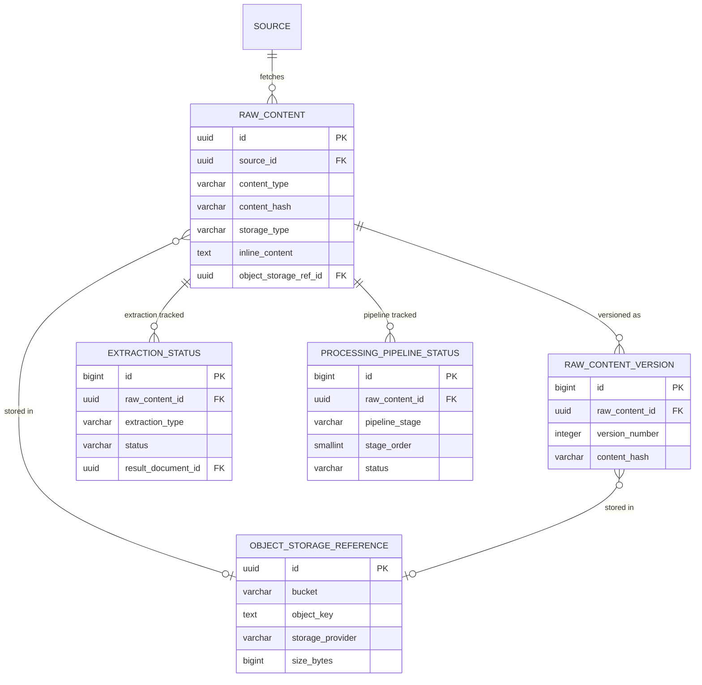

### Table Definitions

---

#### `raw_content`

**Purpose:** Master record for every piece of raw content ingested. Small content (< 256 KB) may be stored inline; larger content uses object storage.

| Column | Type | Nullable | Default | Notes |
|---|---|---|---|---|
| `id` | UUID | NO | gen_random_uuid() | PK |
| `source_id` | UUID | NO | — | FK → source |
| `content_type` | VARCHAR(20) | NO | — | html, rss, json, pdf, xml, text |
| `original_url` | TEXT | YES | — | Where fetched from |
| `content_hash` | VARCHAR(64) | NO | — | SHA-256 for dedup & versioning |
| `storage_type` | VARCHAR(20) | NO | — | inline, object_storage |
| `inline_content` | TEXT | YES | — | Content body if stored inline |
| `object_storage_ref_id` | UUID | YES | — | FK → object_storage_reference |
| `content_size_bytes` | BIGINT | YES | — | — |
| `encoding` | VARCHAR(20) | YES | 'utf-8' | Character encoding |
| `fetched_at` | TIMESTAMPTZ | NO | — | Original fetch timestamp |
| `is_deleted` | BOOLEAN | NO | FALSE | — |
| `created_at` | TIMESTAMPTZ | NO | NOW() | — |

**PK:** `id`
**FK:** `source_id` → `source(id)`, `object_storage_ref_id` → `object_storage_reference(id)`
**Indexes:**
- `idx_raw_content_hash` on `(content_hash)` — dedup lookup
- `idx_raw_content_source_fetched` on `(source_id, fetched_at DESC)` — latest content per source
- `idx_raw_content_type` on `(content_type)` — filter by format
- `idx_raw_content_fetched_at` on `(fetched_at)` — partition key, time-range queries

**Partitioning candidate:** Monthly range on `fetched_at`.

---

#### `raw_content_version`

**Purpose:** When the same URL is re-fetched and content has changed (different `content_hash`), a new version is recorded. Enables detecting when articles are edited post-publication.

| Column | Type | Nullable | Default | Notes |
|---|---|---|---|---|
| `id` | BIGSERIAL | NO | auto | PK |
| `raw_content_id` | UUID | NO | — | FK → raw_content |
| `version_number` | INTEGER | NO | — | Monotonically increasing per content |
| `content_hash` | VARCHAR(64) | NO | — | SHA-256 of this version |
| `storage_type` | VARCHAR(20) | NO | — | inline or object_storage |
| `inline_content` | TEXT | YES | — | — |
| `object_storage_ref_id` | UUID | YES | — | FK → object_storage_reference |
| `detected_at` | TIMESTAMPTZ | NO | — | When the change was detected |
| `change_summary` | TEXT | YES | — | Diff description |

**PK:** `id`
**FK:** `raw_content_id` → `raw_content(id)`, `object_storage_ref_id` → `object_storage_reference(id)`
**Unique:** `uq_raw_content_version` on `(raw_content_id, version_number)`

---

#### `object_storage_reference`

**Purpose:** Pointer to a blob in external object storage (S3, MinIO, GCS, Azure Blob). Decouples the database from the storage backend.

| Column | Type | Nullable | Default | Notes |
|---|---|---|---|---|
| `id` | UUID | NO | gen_random_uuid() | PK |
| `bucket` | VARCHAR(255) | NO | — | Storage bucket name |
| `object_key` | TEXT | NO | — | Full object path/key |
| `storage_provider` | VARCHAR(50) | NO | — | s3, minio, gcs, azure_blob |
| `content_type` | VARCHAR(100) | YES | — | MIME type |
| `size_bytes` | BIGINT | YES | — | — |
| `checksum_sha256` | VARCHAR(64) | YES | — | Integrity verification |
| `uploaded_at` | TIMESTAMPTZ | YES | — | — |
| `is_deleted` | BOOLEAN | NO | FALSE | — |
| `created_at` | TIMESTAMPTZ | NO | NOW() | — |

**PK:** `id`
**Unique:** `uq_object_storage_bucket_key` on `(bucket, object_key)` — no duplicate references
**Indexes:** `idx_object_storage_provider` on `(storage_provider)` — provider-level queries

---

#### `extraction_status`

**Purpose:** Tracks whether each extraction task (text, metadata, links, images) has been completed for a piece of raw content.

| Column | Type | Nullable | Default | Notes |
|---|---|---|---|---|
| `id` | BIGSERIAL | NO | auto | PK |
| `raw_content_id` | UUID | NO | — | FK → raw_content |
| `extraction_type` | VARCHAR(50) | NO | — | text, metadata, links, images, structured_data |
| `status` | VARCHAR(20) | NO | 'pending' | pending, in_progress, completed, failed, skipped |
| `started_at` | TIMESTAMPTZ | YES | — | — |
| `completed_at` | TIMESTAMPTZ | YES | — | — |
| `error_message` | TEXT | YES | — | — |
| `result_document_id` | UUID | YES | — | FK → document (if extraction produced a document) |
| `attempt_count` | SMALLINT | NO | 0 | — |

**PK:** `id`
**FK:** `raw_content_id` → `raw_content(id)`, `result_document_id` → `document(id)`
**Unique:** `uq_extraction_content_type` on `(raw_content_id, extraction_type)` — one status per extraction type per content
**Indexes:** `idx_extraction_status_pending` on `(status) WHERE status IN ('pending', 'failed')` — partial index for work queue

---

#### `processing_pipeline_status`

**Purpose:** Tracks multi-stage processing pipelines (e.g., fetch → extract → normalize → classify → entity_extract). Each stage is a row.

| Column | Type | Nullable | Default | Notes |
|---|---|---|---|---|
| `id` | BIGSERIAL | NO | auto | PK |
| `raw_content_id` | UUID | NO | — | FK → raw_content |
| `pipeline_stage` | VARCHAR(50) | NO | — | fetch, extract, normalize, classify, entity_extract, event_detect |
| `stage_order` | SMALLINT | NO | — | Execution order (1, 2, 3…) |
| `status` | VARCHAR(20) | NO | 'pending' | pending, in_progress, completed, failed, skipped |
| `started_at` | TIMESTAMPTZ | YES | — | — |
| `completed_at` | TIMESTAMPTZ | YES | — | — |
| `error_message` | TEXT | YES | — | — |
| `metadata` | JSONB | YES | — | Stage-specific data |

**PK:** `id`
**FK:** `raw_content_id` → `raw_content(id)`
**Unique:** `uq_pipeline_content_stage` on `(raw_content_id, pipeline_stage)`
**Indexes:** `idx_pipeline_status_queue` on `(pipeline_stage, status) WHERE status = 'pending'`

---

### Module 2 — Relationship Summary

| Relationship | Cardinality | Reason |
|---|---|---|
| source → raw_content | 1:N | Each source produces many raw content records |
| raw_content → raw_content_version | 1:N | Same content re-fetched with changes creates versions |
| raw_content → object_storage_reference | N:1 (optional) | Large content points to external storage |
| raw_content → extraction_status | 1:N | Multiple extraction types per content |
| raw_content → processing_pipeline_status | 1:N | Multiple pipeline stages per content |
| extraction_status → document | N:1 (optional) | Successful extraction may produce a document |

---

## Module 3 — Normalized Documents

### Purpose

Clean, structured representation of articles after extraction from raw content. This is the primary queryable entity for the platform — every search, classification, and analysis operates on documents, not raw content.

### ER Diagram

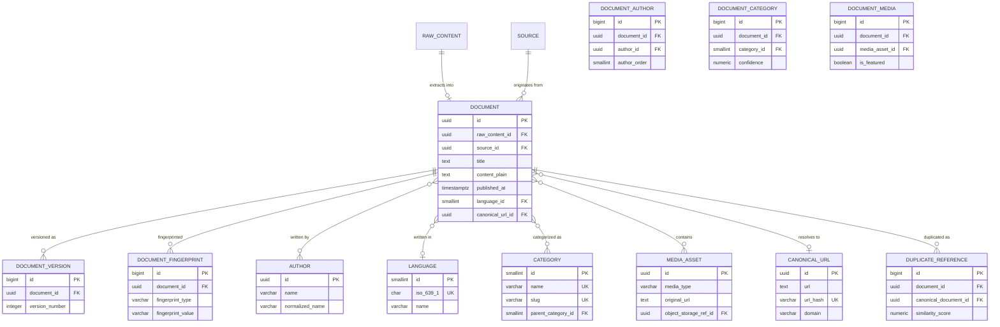

### Table Definitions

---

#### `document`

**Purpose:** The core normalized article entity. Every piece of ingested content that passes extraction becomes a document.

| Column | Type | Nullable | Default | Notes |
|---|---|---|---|---|
| `id` | UUID | NO | gen_random_uuid() | PK |
| `raw_content_id` | UUID | YES | — | FK → raw_content. NULL for manually created docs |
| `source_id` | UUID | NO | — | FK → source |
| `title` | TEXT | NO | — | Article headline |
| `slug` | VARCHAR(500) | YES | — | URL-friendly title |
| `content_plain` | TEXT | YES | — | Cleaned plain text |
| `content_html` | TEXT | YES | — | Cleaned HTML (no scripts/styles) |
| `summary` | TEXT | YES | — | AI-generated or extracted summary |
| `canonical_url_id` | UUID | YES | — | FK → canonical_url |
| `published_at` | TIMESTAMPTZ | YES | — | Publication date (from source) |
| `discovered_at` | TIMESTAMPTZ | NO | NOW() | When platform first saw this |
| `language_id` | SMALLINT | YES | — | FK → language |
| `word_count` | INTEGER | YES | — | — |
| `reading_time_seconds` | INTEGER | YES | — | Estimated read time |
| `is_opinion` | BOOLEAN | NO | FALSE | Opinion vs. news flag |
| `is_breaking` | BOOLEAN | NO | FALSE | Breaking news flag |
| `metadata` | JSONB | YES | — | Extensible fields |
| `is_deleted` | BOOLEAN | NO | FALSE | — |
| `deleted_at` | TIMESTAMPTZ | YES | — | — |
| `created_at` | TIMESTAMPTZ | NO | NOW() | — |
| `updated_at` | TIMESTAMPTZ | NO | NOW() | — |
| `created_by` | UUID | YES | — | — |
| `updated_by` | UUID | YES | — | — |

**PK:** `id`
**FK:** `raw_content_id` → `raw_content(id)`, `source_id` → `source(id)`, `canonical_url_id` → `canonical_url(id)`, `language_id` → `language(id)`
**Indexes:**
- `idx_document_source_published` on `(source_id, published_at DESC)` — latest articles per source
- `idx_document_published_at` on `(published_at DESC)` — global timeline
- `idx_document_discovered_at` on `(discovered_at DESC)` — processing timeline
- `idx_document_language` on `(language_id)` — filter by language
- `idx_document_canonical_url` on `(canonical_url_id)` — find docs sharing URL
- `idx_document_title_trgm` — GIN trigram index on `(title gin_trgm_ops)` for fuzzy title search (requires `pg_trgm`)
- `idx_document_content_fts` — GIN index on `to_tsvector('english', content_plain)` for full-text search

**Partitioning candidate:** Monthly range on `published_at` (with fallback to `discovered_at` for NULL published dates).

---

#### `document_version`

**Purpose:** When a document's title or content is detected to have changed (article edit, correction), a version snapshot is created.

| Column | Type | Nullable | Default | Notes |
|---|---|---|---|---|
| `id` | BIGSERIAL | NO | auto | PK |
| `document_id` | UUID | NO | — | FK → document |
| `version_number` | INTEGER | NO | — | Monotonically increasing |
| `title` | TEXT | YES | — | Title at this version |
| `content_plain` | TEXT | YES | — | Plain text at this version |
| `content_html` | TEXT | YES | — | HTML at this version |
| `summary` | TEXT | YES | — | — |
| `changed_fields` | JSONB | YES | — | List of fields that changed |
| `detected_at` | TIMESTAMPTZ | NO | — | When the change was detected |

**PK:** `id`
**FK:** `document_id` → `document(id)`
**Unique:** `uq_document_version` on `(document_id, version_number)`

---

#### `document_fingerprint`

**Purpose:** Multiple fingerprint types per document for duplicate and near-duplicate detection.

| Column | Type | Nullable | Default | Notes |
|---|---|---|---|---|
| `id` | BIGSERIAL | NO | auto | PK |
| `document_id` | UUID | NO | — | FK → document |
| `fingerprint_type` | VARCHAR(50) | NO | — | simhash, minhash, content_hash, title_hash |
| `fingerprint_value` | VARCHAR(128) | NO | — | The fingerprint value |
| `created_at` | TIMESTAMPTZ | NO | NOW() | — |

**PK:** `id`
**FK:** `document_id` → `document(id)`
**Indexes:**
- `idx_fingerprint_type_value` on `(fingerprint_type, fingerprint_value)` — duplicate lookup
- `idx_fingerprint_document` on `(document_id)` — all fingerprints for a doc

---

#### `author`

**Purpose:** Deduplicated author registry. Authors are shared across documents.

| Column | Type | Nullable | Default | Notes |
|---|---|---|---|---|
| `id` | UUID | NO | gen_random_uuid() | PK |
| `name` | VARCHAR(500) | NO | — | Display name |
| `normalized_name` | VARCHAR(500) | YES | — | Lowercased, trimmed for matching |
| `email` | VARCHAR(255) | YES | — | — |
| `bio` | TEXT | YES | — | — |
| `is_deleted` | BOOLEAN | NO | FALSE | — |
| `created_at` | TIMESTAMPTZ | NO | NOW() | — |
| `updated_at` | TIMESTAMPTZ | NO | NOW() | — |

**PK:** `id`
**Indexes:** `idx_author_normalized_name` on `(normalized_name)` — dedup matching

---

#### `document_author`

**Purpose:** M:N junction between documents and authors, preserving author order and role.

| Column | Type | Nullable | Default | Notes |
|---|---|---|---|---|
| `id` | BIGSERIAL | NO | auto | PK |
| `document_id` | UUID | NO | — | FK → document |
| `author_id` | UUID | NO | — | FK → author |
| `author_order` | SMALLINT | NO | 1 | Position in byline |
| `role` | VARCHAR(50) | NO | 'author' | author, contributor, editor, photographer |

**PK:** `id`
**FK:** `document_id` → `document(id)`, `author_id` → `author(id)`
**Unique:** `uq_document_author` on `(document_id, author_id)`

---

#### `language`

**Purpose:** ISO language lookup. Small, stable table.

| Column | Type | Nullable | Default | Notes |
|---|---|---|---|---|
| `id` | SMALLSERIAL | NO | auto | PK |
| `iso_639_1` | CHAR(2) | YES | — | 2-letter code (en, hi, ta) |
| `iso_639_3` | CHAR(3) | YES | — | 3-letter code (eng, hin, tam) |
| `name` | VARCHAR(100) | NO | — | English name |
| `native_name` | VARCHAR(100) | YES | — | Name in that language |
| `is_deleted` | BOOLEAN | NO | FALSE | — |
| `created_at` | TIMESTAMPTZ | NO | NOW() | — |

**PK:** `id`
**Unique:** `uq_language_iso1` on `(iso_639_1)`, `uq_language_iso3` on `(iso_639_3)`

---

#### `category`

**Purpose:** Editorial categories for documents (distinct from taxonomy — these are source-provided or internal categories like "Politics", "Sports").

| Column | Type | Nullable | Default | Notes |
|---|---|---|---|---|
| `id` | SMALLSERIAL | NO | auto | PK |
| `name` | VARCHAR(255) | NO | — | Category name |
| `slug` | VARCHAR(255) | NO | — | URL-safe slug |
| `description` | TEXT | YES | — | — |
| `parent_category_id` | SMALLINT | YES | — | FK → category (self-ref for hierarchy) |
| `is_deleted` | BOOLEAN | NO | FALSE | — |
| `created_at` | TIMESTAMPTZ | NO | NOW() | — |
| `updated_at` | TIMESTAMPTZ | NO | NOW() | — |

**PK:** `id`
**Unique:** `uq_category_name` on `(name)`, `uq_category_slug` on `(slug)`

---

#### `document_category`

**Purpose:** M:N junction. A document may belong to multiple categories (e.g., "Politics" and "Uttar Pradesh").

| Column | Type | Nullable | Default | Notes |
|---|---|---|---|---|
| `id` | BIGSERIAL | NO | auto | PK |
| `document_id` | UUID | NO | — | FK → document |
| `category_id` | SMALLINT | NO | — | FK → category |
| `confidence` | NUMERIC(5,4) | YES | — | AI classification confidence |
| `assigned_by` | VARCHAR(20) | NO | — | manual, ai, rule |
| `assigned_at` | TIMESTAMPTZ | NO | NOW() | — |

**PK:** `id`
**FK:** `document_id` → `document(id)`, `category_id` → `category(id)`
**Unique:** `uq_document_category` on `(document_id, category_id)`

---

#### `media_asset`

**Purpose:** Shared media registry. Images, videos, and infographics are deduplicated across documents.

| Column | Type | Nullable | Default | Notes |
|---|---|---|---|---|
| `id` | UUID | NO | gen_random_uuid() | PK |
| `media_type` | VARCHAR(20) | NO | — | image, video, audio, infographic |
| `original_url` | TEXT | YES | — | Source URL |
| `object_storage_ref_id` | UUID | YES | — | FK → object_storage_reference |
| `caption` | TEXT | YES | — | — |
| `alt_text` | TEXT | YES | — | Accessibility text |
| `width` | INTEGER | YES | — | Pixels |
| `height` | INTEGER | YES | — | Pixels |
| `duration_seconds` | INTEGER | YES | — | For video/audio |
| `file_size_bytes` | BIGINT | YES | — | — |
| `mime_type` | VARCHAR(100) | YES | — | — |
| `is_deleted` | BOOLEAN | NO | FALSE | — |
| `created_at` | TIMESTAMPTZ | NO | NOW() | — |

**PK:** `id`
**FK:** `object_storage_ref_id` → `object_storage_reference(id)`

---

#### `document_media`

**Purpose:** M:N junction between documents and media assets.

| Column | Type | Nullable | Default | Notes |
|---|---|---|---|---|
| `id` | BIGSERIAL | NO | auto | PK |
| `document_id` | UUID | NO | — | FK → document |
| `media_asset_id` | UUID | NO | — | FK → media_asset |
| `display_order` | SMALLINT | NO | 0 | Order in article |
| `is_featured` | BOOLEAN | NO | FALSE | Featured/hero image |

**PK:** `id`
**FK:** `document_id` → `document(id)`, `media_asset_id` → `media_asset(id)`
**Unique:** `uq_document_media` on `(document_id, media_asset_id)`

---

#### `canonical_url`

**Purpose:** Normalized URL deduplication. Multiple documents may share the same canonical URL (syndicated content).

| Column | Type | Nullable | Default | Notes |
|---|---|---|---|---|
| `id` | UUID | NO | gen_random_uuid() | PK |
| `url` | TEXT | NO | — | Full canonical URL |
| `url_hash` | VARCHAR(64) | NO | — | SHA-256 of normalized URL |
| `domain` | VARCHAR(255) | YES | — | Extracted domain |
| `first_seen_at` | TIMESTAMPTZ | NO | NOW() | — |
| `created_at` | TIMESTAMPTZ | NO | NOW() | — |

**PK:** `id`
**Unique:** `uq_canonical_url_hash` on `(url_hash)` — fast dedup without comparing full URLs

---

#### `duplicate_reference`

**Purpose:** Records when a document is identified as a duplicate or near-duplicate of another.

| Column | Type | Nullable | Default | Notes |
|---|---|---|---|---|
| `id` | BIGSERIAL | NO | auto | PK |
| `document_id` | UUID | NO | — | FK → document (the duplicate) |
| `canonical_document_id` | UUID | NO | — | FK → document (the original) |
| `similarity_score` | NUMERIC(5,4) | YES | — | 0.0000–1.0000 |
| `detection_method` | VARCHAR(50) | NO | — | simhash, minhash, url_match, content_hash |
| `detected_at` | TIMESTAMPTZ | NO | NOW() | — |
| `is_confirmed` | BOOLEAN | NO | FALSE | Human-validated |

**PK:** `id`
**FK:** `document_id` → `document(id)`, `canonical_document_id` → `document(id)`
**Unique:** `uq_duplicate_pair` on `(document_id, canonical_document_id)`
**Check:** `document_id != canonical_document_id`
**Indexes:** `idx_duplicate_canonical` on `(canonical_document_id)` — find all duplicates of a document

---

### Module 3 — Relationship Summary

| Relationship | Cardinality | Reason |
|---|---|---|
| raw_content → document | 1:1 (optional) | Each raw content produces at most one document |
| source → document | 1:N | A source publishes many documents |
| document ↔ author | M:N via document_author | Articles have multiple authors; authors write for multiple outlets |
| document → language | M:1 | Each document has one primary language |
| document ↔ category | M:N via document_category | Cross-categorization |
| document ↔ media_asset | M:N via document_media | Media shared across syndicated content |
| document → canonical_url | M:1 | Multiple documents may share a canonical URL |
| document → document (via duplicate_reference) | M:N | Bidirectional but stored directionally (duplicate → original) |
| document → document_version | 1:N | Edit history |
| document → document_fingerprint | 1:N | Multiple fingerprint algorithms |

---

## Module 4 — Event Resolution

### Purpose

The most strategically important module. Instead of treating each article as an isolated unit, the platform resolves articles into **Events** — real-world occurrences that may be covered by dozens of sources. A single event (e.g., "PM announces new infrastructure plan") generates a Reuters wire, TOI article, government press release, and multiple social media posts. The Event model correlates all of these.

### ER Diagram

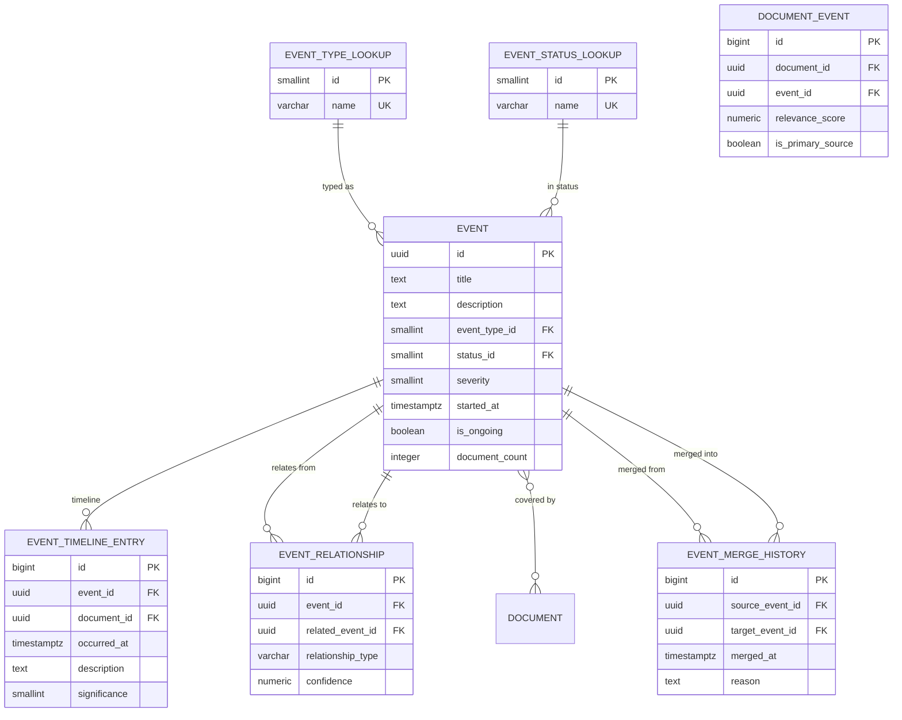

### Table Definitions

---

#### `event_type_lookup`

**Purpose:** Categorizes events: policy_announcement, natural_disaster, election, protest, infrastructure, legislation, crime, economic, diplomatic, cultural, sports, health_crisis.

| Column | Type | Nullable | Default | Notes |
|---|---|---|---|---|
| `id` | SMALLSERIAL | NO | auto | PK |
| `name` | VARCHAR(100) | NO | — | UNIQUE |
| `description` | TEXT | YES | — | — |
| `is_deleted` | BOOLEAN | NO | FALSE | — |
| `created_at` | TIMESTAMPTZ | NO | NOW() | — |

**PK:** `id`
**Unique:** `uq_event_type_name` on `(name)`

---

#### `event_status_lookup`

**Purpose:** Event lifecycle states.

| Column | Type | Nullable | Default | Notes |
|---|---|---|---|---|
| `id` | SMALLSERIAL | NO | auto | PK |
| `name` | VARCHAR(50) | NO | — | emerging, developing, ongoing, concluded, archived |
| `description` | TEXT | YES | — | — |
| `display_order` | SMALLINT | YES | — | UI sort order |

**PK:** `id`
**Unique:** `uq_event_status_name` on `(name)`

---

#### `event`

**Purpose:** The core event entity representing a real-world occurrence.

| Column | Type | Nullable | Default | Notes |
|---|---|---|---|---|
| `id` | UUID | NO | gen_random_uuid() | PK |
| `title` | TEXT | NO | — | Descriptive event title |
| `description` | TEXT | YES | — | Synthesized event description |
| `event_type_id` | SMALLINT | YES | — | FK → event_type_lookup |
| `status_id` | SMALLINT | NO | — | FK → event_status_lookup |
| `severity` | SMALLINT | YES | — | 1 (low) to 5 (critical) |
| `started_at` | TIMESTAMPTZ | YES | — | When the event began |
| `ended_at` | TIMESTAMPTZ | YES | — | When the event concluded |
| `is_ongoing` | BOOLEAN | NO | TRUE | — |
| `primary_location_id` | BIGINT | YES | — | FK → location_mention |
| `document_count` | INTEGER | NO | 0 | Denormalized count for quick display |
| `first_reported_at` | TIMESTAMPTZ | YES | — | Timestamp of first covering document |
| `last_updated_at` | TIMESTAMPTZ | YES | — | Last time new info was added |
| `metadata` | JSONB | YES | — | Extensible attributes |
| `is_deleted` | BOOLEAN | NO | FALSE | — |
| `deleted_at` | TIMESTAMPTZ | YES | — | — |
| `created_at` | TIMESTAMPTZ | NO | NOW() | — |
| `updated_at` | TIMESTAMPTZ | NO | NOW() | — |
| `created_by` | UUID | YES | — | — |
| `updated_by` | UUID | YES | — | — |

**PK:** `id`
**FK:** `event_type_id` → `event_type_lookup(id)`, `status_id` → `event_status_lookup(id)`
**Indexes:**
- `idx_event_type` on `(event_type_id)`
- `idx_event_status` on `(status_id)`
- `idx_event_started_at` on `(started_at DESC)` — timeline queries
- `idx_event_severity` on `(severity)` — high-priority filtering
- `idx_event_ongoing` on `(is_ongoing) WHERE is_deleted = FALSE` — active events
- `idx_event_title_trgm` — GIN trigram on `(title gin_trgm_ops)` for fuzzy search

---

#### `document_event`

**Purpose:** M:N mapping between documents and events. The critical junction that resolves "which articles cover which event."

| Column | Type | Nullable | Default | Notes |
|---|---|---|---|---|
| `id` | BIGSERIAL | NO | auto | PK |
| `document_id` | UUID | NO | — | FK → document |
| `event_id` | UUID | NO | — | FK → event |
| `relevance_score` | NUMERIC(5,4) | YES | — | How relevant the article is to the event |
| `is_primary_source` | BOOLEAN | NO | FALSE | Is this the original source? |
| `mapped_by` | VARCHAR(20) | NO | — | ai, manual, rule |
| `mapped_at` | TIMESTAMPTZ | NO | NOW() | — |

**PK:** `id`
**FK:** `document_id` → `document(id)`, `event_id` → `event(id)`
**Unique:** `uq_document_event` on `(document_id, event_id)`
**Indexes:**
- `idx_doc_event_event` on `(event_id)` — all articles for an event
- `idx_doc_event_document` on `(document_id)` — all events for an article

**Why this exists:** This is the heart of event resolution. When the AI detects that three articles from different sources cover the same incident, it creates an event and maps all three documents to it. The `is_primary_source` flag identifies the original reporting source. `relevance_score` allows ranking articles within an event.

---

#### `event_timeline_entry`

**Purpose:** Chronological developments within an event. Each entry represents a significant update or sub-event.

| Column | Type | Nullable | Default | Notes |
|---|---|---|---|---|
| `id` | BIGSERIAL | NO | auto | PK |
| `event_id` | UUID | NO | — | FK → event |
| `document_id` | UUID | YES | — | FK → document (source of this update) |
| `occurred_at` | TIMESTAMPTZ | NO | — | When this development happened |
| `description` | TEXT | NO | — | What happened |
| `significance` | SMALLINT | YES | — | 1–5 importance |
| `is_verified` | BOOLEAN | NO | FALSE | Fact-checked |
| `created_at` | TIMESTAMPTZ | NO | NOW() | — |

**PK:** `id`
**FK:** `event_id` → `event(id)`, `document_id` → `document(id)`
**Indexes:**
- `idx_timeline_event_occurred` on `(event_id, occurred_at)` — chronological timeline per event
- `idx_timeline_occurred_at` on `(occurred_at)` — global timeline

---

#### `event_relationship`

**Purpose:** Directed relationships between events (cause-effect chains, follow-ups, sub-events).

| Column | Type | Nullable | Default | Notes |
|---|---|---|---|---|
| `id` | BIGSERIAL | NO | auto | PK |
| `event_id` | UUID | NO | — | FK → event (from) |
| `related_event_id` | UUID | NO | — | FK → event (to) |
| `relationship_type` | VARCHAR(50) | NO | — | caused_by, led_to, related_to, part_of, follow_up, escalation_of |
| `confidence` | NUMERIC(5,4) | YES | — | AI confidence |
| `created_at` | TIMESTAMPTZ | NO | NOW() | — |

**PK:** `id`
**FK:** `event_id` → `event(id)`, `related_event_id` → `event(id)`
**Unique:** `uq_event_relationship` on `(event_id, related_event_id, relationship_type)`
**Check:** `event_id != related_event_id`
**Indexes:**
- `idx_event_rel_from` on `(event_id)`
- `idx_event_rel_to` on `(related_event_id)`

---

#### `event_merge_history`

**Purpose:** Audit trail for event deduplication. When two events are discovered to be the same real-world occurrence, they are merged. The source event is soft-deleted; all its document mappings are transferred to the target event. This table records the merge for traceability.

| Column | Type | Nullable | Default | Notes |
|---|---|---|---|---|
| `id` | BIGSERIAL | NO | auto | PK |
| `source_event_id` | UUID | NO | — | FK → event (absorbed event) |
| `target_event_id` | UUID | NO | — | FK → event (surviving event) |
| `merged_at` | TIMESTAMPTZ | NO | — | — |
| `merged_by` | UUID | YES | — | User or system ID |
| `reason` | TEXT | YES | — | Why the merge happened |
| `merge_metadata` | JSONB | YES | — | Snapshot of source event before merge |

**PK:** `id`
**FK:** `source_event_id` → `event(id)`, `target_event_id` → `event(id)`
**Check:** `source_event_id != target_event_id`

---

### Module 4 — Relationship Summary

| Relationship | Cardinality | Reason |
|---|---|---|
| event → event_type_lookup | M:1 | Every event has a type |
| event → event_status_lookup | M:1 | Every event has a lifecycle status |
| document ↔ event | M:N via document_event | Core resolution — many articles map to many events |
| event → event_timeline_entry | 1:N | An event has chronological developments |
| event ↔ event | M:N via event_relationship | Events relate to other events (cause-effect, etc.) |
| event → event_merge_history | 1:N (both sides) | Merge audit trail |

---

## Module 5 — Taxonomy

### Purpose

A versioned, hierarchical classification system. The platform uses taxonomies to classify documents into structured themes (e.g., "Public Policy → Infrastructure → Transportation → Railways"). Taxonomies version independently so classification logic can evolve without retroactively invalidating historical classifications.

### Hierarchy Storage: Comparison and Recommendation

The taxonomy tree needs to support: efficient subtree queries, version snapshots, occasional restructuring, and depth up to ~6 levels.

| Approach | Read (Subtree) | Insert/Move | Versioning | Concurrent Writes | Storage Overhead |
|---|---|---|---|---|---|
| **Adjacency List** | Slow (recursive CTE) | Fast (update parent_id) | Easy (copy rows) | Good | Minimal |
| **Materialized Path** | Fast (LIKE 'path%') | Moderate (update descendants) | Moderate | Good | Low (path string) |
| **Nested Set** | Very Fast (lft BETWEEN) | Very Slow (renumber tree) | Difficult | Poor | Low (2 ints) |
| **Closure Table** | Fast (single JOIN) | Moderate (insert pairs) | Excellent | Good | Higher (N² worst case) |

#### Recommendation: **Closure Table + Adjacency List (Hybrid)**

- **`taxonomy_node.parent_node_id`** (Adjacency List) — stores the direct parent for simple parent lookups and tree display.
- **`taxonomy_node_closure`** (Closure Table) — stores all ancestor-descendant pairs with depth for efficient subtree queries, ancestor lookups, and path resolution.

**Why Closure Table wins:**
1. **Versioning compatibility:** When a new taxonomy version is created, the closure table is regenerated from the new node structure. Old version's closure data remains intact.
2. **Query flexibility:** "Give me all descendants of node X" is a single-table query, not a recursive CTE.
3. **Depth queries:** The `depth` column enables "give me all nodes exactly 2 levels below X."
4. **Reasonable overhead:** For a taxonomy of ~500 nodes, the closure table stores ~2,500 rows (avg depth 5) — trivial.
5. **Concurrent-safe:** Insertions add rows; no renumbering required.

### ER Diagram

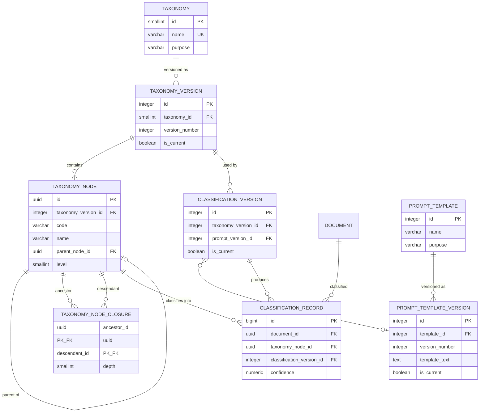

### Table Definitions

---

#### `taxonomy`

**Purpose:** Top-level taxonomy registry. The platform may have multiple taxonomies (e.g., "Themes", "Regions", "Stakeholder Types").

| Column | Type | Nullable | Default | Notes |
|---|---|---|---|---|
| `id` | SMALLSERIAL | NO | auto | PK |
| `name` | VARCHAR(255) | NO | — | UNIQUE |
| `description` | TEXT | YES | — | — |
| `purpose` | VARCHAR(100) | YES | — | classification, tagging, navigation |
| `is_deleted` | BOOLEAN | NO | FALSE | — |
| `created_at` | TIMESTAMPTZ | NO | NOW() | — |
| `updated_at` | TIMESTAMPTZ | NO | NOW() | — |

**PK:** `id`
**Unique:** `uq_taxonomy_name` on `(name)`

---

#### `taxonomy_version`

**Purpose:** Each taxonomy can have multiple versions. Only one is `is_current = TRUE` at a time.

| Column | Type | Nullable | Default | Notes |
|---|---|---|---|---|
| `id` | SERIAL | NO | auto | PK |
| `taxonomy_id` | SMALLINT | NO | — | FK → taxonomy |
| `version_number` | INTEGER | NO | — | Monotonically increasing |
| `is_current` | BOOLEAN | NO | FALSE | — |
| `published_at` | TIMESTAMPTZ | YES | — | When this version went live |
| `notes` | TEXT | YES | — | Changelog |
| `created_at` | TIMESTAMPTZ | NO | NOW() | — |
| `created_by` | UUID | YES | — | — |

**PK:** `id`
**FK:** `taxonomy_id` → `taxonomy(id)`
**Unique:** `uq_taxonomy_version` on `(taxonomy_id, version_number)`
**Indexes:** `idx_taxonomy_version_current` on `(taxonomy_id) WHERE is_current = TRUE` — fast active version lookup

---

#### `taxonomy_node`

**Purpose:** Individual node in the taxonomy tree, scoped to a specific version. Carries both the adjacency list parent and the level for convenience.

| Column | Type | Nullable | Default | Notes |
|---|---|---|---|---|
| `id` | UUID | NO | gen_random_uuid() | PK |
| `taxonomy_version_id` | INTEGER | NO | — | FK → taxonomy_version |
| `code` | VARCHAR(50) | NO | — | Machine-readable code (e.g., "INFRA.TRANS.RAIL") |
| `name` | VARCHAR(255) | NO | — | Display name (e.g., "Railways") |
| `description` | TEXT | YES | — | — |
| `parent_node_id` | UUID | YES | — | FK → taxonomy_node (NULL for roots) |
| `level` | SMALLINT | NO | 0 | Depth from root (0 = root) |
| `sort_order` | SMALLINT | NO | 0 | Display order among siblings |
| `metadata` | JSONB | YES | — | Extensible attributes |
| `is_deleted` | BOOLEAN | NO | FALSE | — |
| `created_at` | TIMESTAMPTZ | NO | NOW() | — |
| `updated_at` | TIMESTAMPTZ | NO | NOW() | — |

**PK:** `id`
**FK:** `taxonomy_version_id` → `taxonomy_version(id)`, `parent_node_id` → `taxonomy_node(id)`
**Unique:** `uq_taxonomy_node_code` on `(taxonomy_version_id, code)`
**Indexes:**
- `idx_taxonomy_node_version` on `(taxonomy_version_id)` — all nodes for a version
- `idx_taxonomy_node_parent` on `(parent_node_id)` — children of a node
- `idx_taxonomy_node_level` on `(taxonomy_version_id, level, sort_order)` — level-based display

---

#### `taxonomy_node_closure`

**Purpose:** Closure table storing all ancestor-descendant pairs. For a node at depth 3, there are 4 rows: (self→self, depth 0), (parent→self, depth 1), (grandparent→self, depth 2), (root→self, depth 3).

| Column | Type | Nullable | Default | Notes |
|---|---|---|---|---|
| `ancestor_id` | UUID | NO | — | FK → taxonomy_node |
| `descendant_id` | UUID | NO | — | FK → taxonomy_node |
| `depth` | SMALLINT | NO | — | Distance (0 = self) |

**PK:** `(ancestor_id, descendant_id)` — composite primary key
**FK:** `ancestor_id` → `taxonomy_node(id)`, `descendant_id` → `taxonomy_node(id)`
**Indexes:**
- `idx_closure_descendant` on `(descendant_id)` — "give me all ancestors of X"
- `idx_closure_ancestor_depth` on `(ancestor_id, depth)` — "give me descendants of X at depth N"

**Example queries this enables:**
- All descendants of "Infrastructure": `SELECT descendant_id FROM taxonomy_node_closure WHERE ancestor_id = ? AND depth > 0`
- All ancestors of "Railways": `SELECT ancestor_id FROM taxonomy_node_closure WHERE descendant_id = ? AND depth > 0`
- Direct children only: `WHERE ancestor_id = ? AND depth = 1`
- Full path to root: `WHERE descendant_id = ? ORDER BY depth DESC`

---

#### `classification_record`

**Purpose:** Records that document X was classified under taxonomy node Y using classification version Z.

| Column | Type | Nullable | Default | Notes |
|---|---|---|---|---|
| `id` | BIGSERIAL | NO | auto | PK |
| `document_id` | UUID | NO | — | FK → document |
| `taxonomy_node_id` | UUID | NO | — | FK → taxonomy_node |
| `classification_version_id` | INTEGER | NO | — | FK → classification_version |
| `confidence` | NUMERIC(5,4) | YES | — | 0.0000–1.0000 |
| `classified_by` | VARCHAR(20) | NO | — | ai, manual, rule |
| `classified_at` | TIMESTAMPTZ | NO | NOW() | — |
| `is_primary` | BOOLEAN | NO | FALSE | Primary classification |

**PK:** `id`
**FK:** `document_id` → `document(id)`, `taxonomy_node_id` → `taxonomy_node(id)`, `classification_version_id` → `classification_version(id)`
**Indexes:**
- `idx_classification_document` on `(document_id)` — all classifications for a doc
- `idx_classification_node` on `(taxonomy_node_id)` — all docs under a node
- `idx_classification_version` on `(classification_version_id)` — all results for a version
- `idx_classification_confidence` on `(confidence DESC)` — high-confidence first

---

#### `classification_version`

**Purpose:** Bundles a taxonomy version, prompt version, and model together. When any of these change, a new classification version is created. This allows comparing classification results across different configurations.

| Column | Type | Nullable | Default | Notes |
|---|---|---|---|---|
| `id` | SERIAL | NO | auto | PK |
| `name` | VARCHAR(255) | YES | — | Human-readable label |
| `taxonomy_version_id` | INTEGER | NO | — | FK → taxonomy_version |
| `prompt_version_id` | INTEGER | YES | — | FK → prompt_template_version |
| `model_id` | INTEGER | YES | — | FK → ai_model (Module 10) |
| `is_current` | BOOLEAN | NO | FALSE | — |
| `activated_at` | TIMESTAMPTZ | YES | — | — |
| `deactivated_at` | TIMESTAMPTZ | YES | — | — |
| `created_at` | TIMESTAMPTZ | NO | NOW() | — |
| `created_by` | UUID | YES | — | — |

**PK:** `id`
**FK:** `taxonomy_version_id` → `taxonomy_version(id)`, `prompt_version_id` → `prompt_template_version(id)`, `model_id` → `ai_model(id)`

---

#### `prompt_template`

**Purpose:** Named prompt template definitions for various AI tasks (classification, extraction, summarization, event_detection).

| Column | Type | Nullable | Default | Notes |
|---|---|---|---|---|
| `id` | SERIAL | NO | auto | PK |
| `name` | VARCHAR(255) | NO | — | Human-readable name |
| `purpose` | VARCHAR(100) | NO | — | classification, extraction, summarization, event_detection |
| `description` | TEXT | YES | — | — |
| `is_deleted` | BOOLEAN | NO | FALSE | — |
| `created_at` | TIMESTAMPTZ | NO | NOW() | — |
| `updated_at` | TIMESTAMPTZ | NO | NOW() | — |

**PK:** `id`

---

#### `prompt_template_version`

**Purpose:** Immutable version snapshots of prompt templates. Each version captures the full prompt text, system prompt, and expected variables.

| Column | Type | Nullable | Default | Notes |
|---|---|---|---|---|
| `id` | SERIAL | NO | auto | PK |
| `template_id` | INTEGER | NO | — | FK → prompt_template |
| `version_number` | INTEGER | NO | — | Monotonically increasing |
| `template_text` | TEXT | NO | — | The prompt body with `{{variable}}` placeholders |
| `system_prompt` | TEXT | YES | — | System-level instructions |
| `variables` | JSONB | YES | — | List of expected template variables |
| `is_current` | BOOLEAN | NO | FALSE | — |
| `activated_at` | TIMESTAMPTZ | YES | — | — |
| `deactivated_at` | TIMESTAMPTZ | YES | — | — |
| `performance_notes` | TEXT | YES | — | Observed quality notes |
| `created_at` | TIMESTAMPTZ | NO | NOW() | — |
| `created_by` | UUID | YES | — | — |

**PK:** `id`
**FK:** `template_id` → `prompt_template(id)`
**Unique:** `uq_prompt_version` on `(template_id, version_number)`

---

### Module 5 — Relationship Summary

| Relationship | Cardinality | Reason |
|---|---|---|
| taxonomy → taxonomy_version | 1:N | A taxonomy evolves through versions |
| taxonomy_version → taxonomy_node | 1:N | Each version has its own set of nodes |
| taxonomy_node → taxonomy_node | M:1 (parent) | Adjacency list for direct parent |
| taxonomy_node ↔ taxonomy_node | M:N (closure) | Transitive closure for all ancestor/descendant pairs |
| taxonomy_version → classification_version | 1:N | Multiple classification configs per taxonomy version |
| classification_version → classification_record | 1:N | One config produces many classification results |
| document → classification_record | 1:N | A document may be classified multiple times (different versions) |
| taxonomy_node → classification_record | 1:N | A node appears in many classification results |
| prompt_template → prompt_template_version | 1:N | Prompts evolve through versions |

---

## Module 6 — Entities

### Purpose

Named Entity Recognition (NER) results stored with full provenance. Entities are deduplicated, linked across documents, and interconnected via typed relationships. This module provides the foundation for both the Knowledge Graph (Module 11) and stakeholder analysis.

### ER Diagram

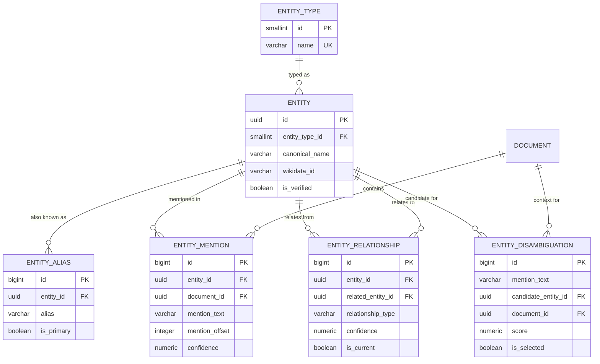

### Table Definitions

---

#### `entity_type`

**Purpose:** Categorizes entities: person, organization, location, product, legislation, policy, scheme, political_party, government_body, judicial_body.

| Column | Type | Nullable | Default | Notes |
|---|---|---|---|---|
| `id` | SMALLSERIAL | NO | auto | PK |
| `name` | VARCHAR(100) | NO | — | UNIQUE |
| `description` | TEXT | YES | — | — |
| `is_deleted` | BOOLEAN | NO | FALSE | — |
| `created_at` | TIMESTAMPTZ | NO | NOW() | — |

**PK:** `id`
**Unique:** `uq_entity_type_name` on `(name)`

---

#### `entity`

**Purpose:** Deduplicated entity registry. Each real-world person, organization, or entity is represented once.

| Column | Type | Nullable | Default | Notes |
|---|---|---|---|---|
| `id` | UUID | NO | gen_random_uuid() | PK |
| `entity_type_id` | SMALLINT | NO | — | FK → entity_type |
| `canonical_name` | VARCHAR(500) | NO | — | Primary name |
| `description` | TEXT | YES | — | — |
| `wikidata_id` | VARCHAR(20) | YES | — | Wikidata Q-number for disambiguation |
| `metadata` | JSONB | YES | — | Type-specific attributes |
| `is_verified` | BOOLEAN | NO | FALSE | Human-verified entity |
| `is_deleted` | BOOLEAN | NO | FALSE | — |
| `deleted_at` | TIMESTAMPTZ | YES | — | — |
| `created_at` | TIMESTAMPTZ | NO | NOW() | — |
| `updated_at` | TIMESTAMPTZ | NO | NOW() | — |

**PK:** `id`
**FK:** `entity_type_id` → `entity_type(id)`
**Indexes:**
- `idx_entity_type` on `(entity_type_id)` — filter by type
- `idx_entity_canonical_name` on `(canonical_name)` — name lookup
- `idx_entity_canonical_name_trgm` — GIN trigram for fuzzy name search
- `idx_entity_wikidata` on `(wikidata_id) WHERE wikidata_id IS NOT NULL` — external ID lookup

---

#### `entity_alias`

**Purpose:** Alternative names for an entity. "Narendra Modi" → ["PM Modi", "Modi", "NaMo", "नरेंद्र मोदी"]. Critical for NER matching.

| Column | Type | Nullable | Default | Notes |
|---|---|---|---|---|
| `id` | BIGSERIAL | NO | auto | PK |
| `entity_id` | UUID | NO | — | FK → entity |
| `alias` | VARCHAR(500) | NO | — | Alternative name |
| `language_id` | SMALLINT | YES | — | FK → language |
| `is_primary` | BOOLEAN | NO | FALSE | — |
| `source` | VARCHAR(50) | YES | — | manual, ai, wikidata |
| `created_at` | TIMESTAMPTZ | NO | NOW() | — |

**PK:** `id`
**FK:** `entity_id` → `entity(id)`, `language_id` → `language(id)`
**Unique:** `uq_entity_alias` on `(entity_id, alias)`
**Indexes:** `idx_entity_alias_alias` on `(alias)` — lookup by alias text

---

#### `entity_mention`

**Purpose:** Every occurrence of an entity within a document. High-volume table — one entity may be mentioned multiple times per document, across millions of documents.

| Column | Type | Nullable | Default | Notes |
|---|---|---|---|---|
| `id` | BIGSERIAL | NO | auto | PK |
| `entity_id` | UUID | NO | — | FK → entity |
| `document_id` | UUID | NO | — | FK → document |
| `mention_text` | VARCHAR(500) | YES | — | Exact text matched |
| `mention_offset` | INTEGER | YES | — | Character offset in content |
| `mention_length` | SMALLINT | YES | — | Length of mention text |
| `confidence` | NUMERIC(5,4) | YES | — | NER confidence |
| `context_snippet` | TEXT | YES | — | Surrounding text for context |
| `extraction_method` | VARCHAR(50) | NO | — | ner, regex, dictionary, ai |
| `created_at` | TIMESTAMPTZ | NO | NOW() | — |

**PK:** `id`
**FK:** `entity_id` → `entity(id)`, `document_id` → `document(id)`
**Indexes:**
- `idx_mention_entity` on `(entity_id)` — all mentions of an entity
- `idx_mention_document` on `(document_id)` — all entities in a document
- `idx_mention_entity_document` on `(entity_id, document_id)` — entity within specific doc
- `idx_mention_created_at` on `(created_at)` — partition key

**Partitioning candidate:** Monthly range on `created_at`.

---

#### `entity_relationship`

**Purpose:** Typed, directed, temporal relationships between entities. "Person X works_for Organization Y since 2024."

| Column | Type | Nullable | Default | Notes |
|---|---|---|---|---|
| `id` | BIGSERIAL | NO | auto | PK |
| `entity_id` | UUID | NO | — | FK → entity (subject) |
| `related_entity_id` | UUID | NO | — | FK → entity (object) |
| `relationship_type` | VARCHAR(100) | NO | — | works_for, leads, owns, subsidiary_of, member_of, spouse_of, ally_of, opposes |
| `confidence` | NUMERIC(5,4) | YES | — | AI confidence |
| `source_document_id` | UUID | YES | — | FK → document (evidence) |
| `valid_from` | TIMESTAMPTZ | YES | — | When the relationship started |
| `valid_until` | TIMESTAMPTZ | YES | — | When the relationship ended (NULL = current) |
| `is_current` | BOOLEAN | NO | TRUE | Active relationship |
| `created_at` | TIMESTAMPTZ | NO | NOW() | — |
| `updated_at` | TIMESTAMPTZ | NO | NOW() | — |

**PK:** `id`
**FK:** `entity_id` → `entity(id)`, `related_entity_id` → `entity(id)`, `source_document_id` → `document(id)`
**Check:** `entity_id != related_entity_id`
**Indexes:**
- `idx_entity_rel_from` on `(entity_id)`
- `idx_entity_rel_to` on `(related_entity_id)`
- `idx_entity_rel_type` on `(relationship_type)`
- `idx_entity_rel_current` on `(entity_id) WHERE is_current = TRUE` — active relationships

**Three relationship dimensions explained:**
- **Article → Entity** (via `entity_mention`): "This document mentions Person X." One-to-many per document.
- **Event → Entity** (via `classification_stakeholder` in Module 9, and `entity_mention` joined through `document_event`): "This event involves Organization Y." Derived through the document→event junction.
- **Entity → Entity** (via `entity_relationship`): "Person X works for Organization Y." Direct typed relationship with temporal validity.

---

#### `entity_disambiguation`

**Purpose:** When NER detects a mention like "Modi", there may be multiple candidate entities. This table records all candidates and which one was selected.

| Column | Type | Nullable | Default | Notes |
|---|---|---|---|---|
| `id` | BIGSERIAL | NO | auto | PK |
| `mention_text` | VARCHAR(500) | NO | — | Ambiguous mention text |
| `candidate_entity_id` | UUID | NO | — | FK → entity |
| `document_id` | UUID | NO | — | FK → document (context) |
| `score` | NUMERIC(5,4) | NO | — | Disambiguation confidence |
| `is_selected` | BOOLEAN | NO | FALSE | Winning candidate |
| `disambiguation_method` | VARCHAR(50) | YES | — | context_similarity, popularity, coreference, ai |
| `created_at` | TIMESTAMPTZ | NO | NOW() | — |

**PK:** `id`
**FK:** `candidate_entity_id` → `entity(id)`, `document_id` → `document(id)`
**Indexes:**
- `idx_disambig_mention_doc` on `(mention_text, document_id)` — all candidates for a mention in context
- `idx_disambig_entity` on `(candidate_entity_id)` — how often is this entity a candidate

---

### Module 6 — Relationship Summary

| Relationship | Cardinality | Reason |
|---|---|---|
| entity_type → entity | 1:N | Every entity has exactly one type |
| entity → entity_alias | 1:N | Multiple alternative names |
| entity → entity_mention | 1:N | An entity is mentioned across many documents |
| document → entity_mention | 1:N | A document mentions many entities |
| entity ↔ entity | M:N via entity_relationship | Inter-entity relationships with types and temporal validity |
| entity → entity_disambiguation | 1:N | An entity may be a candidate in many disambiguation decisions |

---

## Module 7 — Geography

### Purpose

Structured geographic reference data for location resolution. When an article mentions "Prayagraj" or "Uttar Pradesh," the system resolves it to a known geographic entity with coordinates. Supports future GIS integration (PostGIS) and geospatial queries.

### ER Diagram

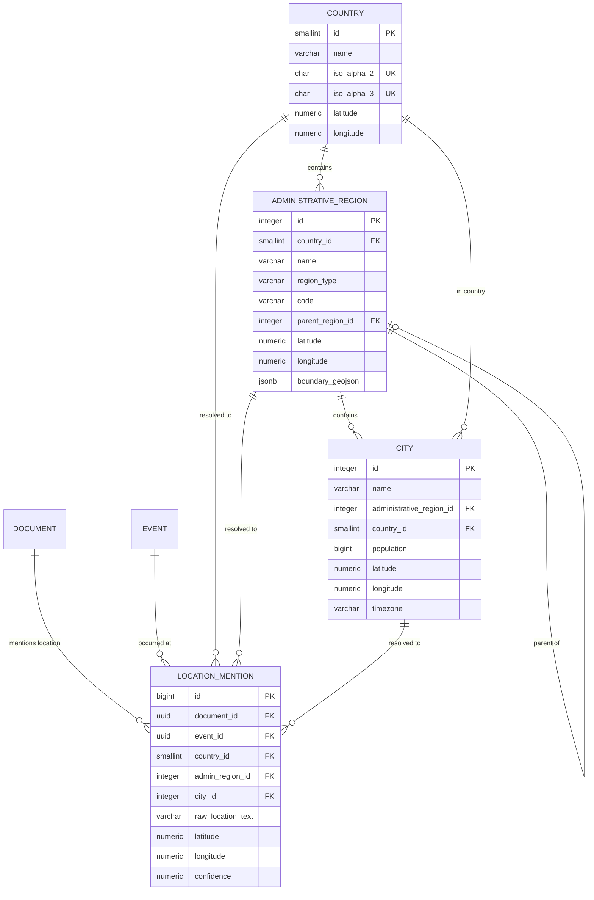

### Table Definitions

---

#### `country`

**Purpose:** ISO 3166-1 country reference. Pre-populated with ~250 countries. Rarely changes.

| Column | Type | Nullable | Default | Notes |
|---|---|---|---|---|
| `id` | SMALLSERIAL | NO | auto | PK |
| `name` | VARCHAR(255) | NO | — | Common English name |
| `official_name` | VARCHAR(500) | YES | — | Official name |
| `iso_alpha_2` | CHAR(2) | YES | — | UNIQUE — IN, US, GB |
| `iso_alpha_3` | CHAR(3) | YES | — | UNIQUE — IND, USA, GBR |
| `iso_numeric` | SMALLINT | YES | — | UNIQUE — 356, 840, 826 |
| `continent` | VARCHAR(50) | YES | — | Asia, Europe, etc. |
| `latitude` | NUMERIC(9,6) | YES | — | Centroid latitude |
| `longitude` | NUMERIC(9,6) | YES | — | Centroid longitude |
| `is_deleted` | BOOLEAN | NO | FALSE | — |
| `created_at` | TIMESTAMPTZ | NO | NOW() | — |

**PK:** `id`
**Unique:** `uq_country_iso2` on `(iso_alpha_2)`, `uq_country_iso3` on `(iso_alpha_3)`, `uq_country_numeric` on `(iso_numeric)`

---

#### `administrative_region`

**Purpose:** States, provinces, territories, union territories, divisions. Supports self-referencing for hierarchical admin divisions (e.g., Division → District).

| Column | Type | Nullable | Default | Notes |
|---|---|---|---|---|
| `id` | SERIAL | NO | auto | PK |
| `country_id` | SMALLINT | NO | — | FK → country |
| `name` | VARCHAR(255) | NO | — | Region name |
| `region_type` | VARCHAR(50) | NO | — | state, province, territory, union_territory, division, district |
| `code` | VARCHAR(20) | YES | — | State/region code (e.g., "UP", "MH") |
| `parent_region_id` | INTEGER | YES | — | FK → administrative_region (self-ref) |
| `latitude` | NUMERIC(9,6) | YES | — | — |
| `longitude` | NUMERIC(9,6) | YES | — | — |
| `boundary_geojson` | JSONB | YES | — | GeoJSON polygon for future PostGIS |
| `is_deleted` | BOOLEAN | NO | FALSE | — |
| `created_at` | TIMESTAMPTZ | NO | NOW() | — |
| `updated_at` | TIMESTAMPTZ | NO | NOW() | — |

**PK:** `id`
**FK:** `country_id` → `country(id)`, `parent_region_id` → `administrative_region(id)`
**Unique:** `uq_admin_region_code` on `(country_id, code) WHERE code IS NOT NULL`
**Indexes:**
- `idx_admin_region_country` on `(country_id)` — all regions in a country
- `idx_admin_region_parent` on `(parent_region_id)` — sub-regions
- `idx_admin_region_type` on `(region_type)` — filter by level

**Future GIS compatibility:** The `boundary_geojson` column stores GeoJSON polygons as JSONB. When PostGIS is added, a `GEOMETRY` column can be created alongside and populated via `ST_GeomFromGeoJSON(boundary_geojson)`. The JSONB column remains for portability.

---

#### `city`

**Purpose:** City/town reference data. Pre-populated for major cities; extended as new cities are encountered.

| Column | Type | Nullable | Default | Notes |
|---|---|---|---|---|
| `id` | SERIAL | NO | auto | PK |
| `name` | VARCHAR(255) | NO | — | City name |
| `administrative_region_id` | INTEGER | YES | — | FK → administrative_region |
| `country_id` | SMALLINT | NO | — | FK → country |
| `population` | BIGINT | YES | — | Latest census population |
| `latitude` | NUMERIC(9,6) | YES | — | — |
| `longitude` | NUMERIC(9,6) | YES | — | — |
| `timezone` | VARCHAR(50) | YES | — | IANA timezone |
| `is_deleted` | BOOLEAN | NO | FALSE | — |
| `created_at` | TIMESTAMPTZ | NO | NOW() | — |
| `updated_at` | TIMESTAMPTZ | NO | NOW() | — |

**PK:** `id`
**FK:** `administrative_region_id` → `administrative_region(id)`, `country_id` → `country(id)`
**Indexes:**
- `idx_city_region` on `(administrative_region_id)` — cities in a region
- `idx_city_country` on `(country_id)` — cities in a country
- `idx_city_name_trgm` — GIN trigram for fuzzy city name search
- `idx_city_coordinates` on `(latitude, longitude)` — proximity queries (will become GiST with PostGIS)

---

#### `location_mention`

**Purpose:** Records location references found in documents and events, resolved to geographic entities. Links the unstructured world ("Sangam area, Prayagraj") to structured geography.

| Column | Type | Nullable | Default | Notes |
|---|---|---|---|---|
| `id` | BIGSERIAL | NO | auto | PK |
| `document_id` | UUID | YES | — | FK → document |
| `event_id` | UUID | YES | — | FK → event |
| `country_id` | SMALLINT | YES | — | FK → country (resolved) |
| `administrative_region_id` | INTEGER | YES | — | FK → administrative_region (resolved) |
| `city_id` | INTEGER | YES | — | FK → city (resolved) |
| `raw_location_text` | VARCHAR(500) | NO | — | Original text as found |
| `latitude` | NUMERIC(9,6) | YES | — | Resolved coordinates |
| `longitude` | NUMERIC(9,6) | YES | — | — |
| `confidence` | NUMERIC(5,4) | YES | — | Resolution confidence |
| `resolution_method` | VARCHAR(50) | YES | — | geocoding, dictionary, ai, manual |
| `created_at` | TIMESTAMPTZ | NO | NOW() | — |

**PK:** `id`
**FK:** `document_id` → `document(id)`, `event_id` → `event(id)`, `country_id` → `country(id)`, `administrative_region_id` → `administrative_region(id)`, `city_id` → `city(id)`
**Check:** `document_id IS NOT NULL OR event_id IS NOT NULL` — must reference at least one
**Indexes:**
- `idx_location_mention_document` on `(document_id)` — locations in a document
- `idx_location_mention_event` on `(event_id)` — locations of an event
- `idx_location_mention_city` on `(city_id)` — mentions of a city
- `idx_location_mention_region` on `(administrative_region_id)` — mentions of a region
- `idx_location_mention_country` on `(country_id)` — mentions of a country
- `idx_location_mention_coords` on `(latitude, longitude) WHERE latitude IS NOT NULL` — proximity queries

---

### Module 7 — Relationship Summary

| Relationship | Cardinality | Reason |
|---|---|---|
| country → administrative_region | 1:N | A country has many states/provinces |
| administrative_region → administrative_region | M:1 (self-ref) | Hierarchical admin divisions (state → district) |
| administrative_region → city | 1:N | A region contains many cities |
| country → city | 1:N | Denormalized country FK on city for direct queries |
| document → location_mention | 1:N | A document may mention multiple locations |
| event → location_mention | 1:N | An event may span multiple locations |
| location_mention → country/region/city | M:1 each (optional) | Resolution at different granularity levels |

---

## Module 8 — Keywords

### Purpose

Managed keyword lists with boolean rules for monitoring specific topics. Keywords are versioned so changes can be tracked and rolled back. Keyword hits record where each keyword was found in documents.

### ER Diagram

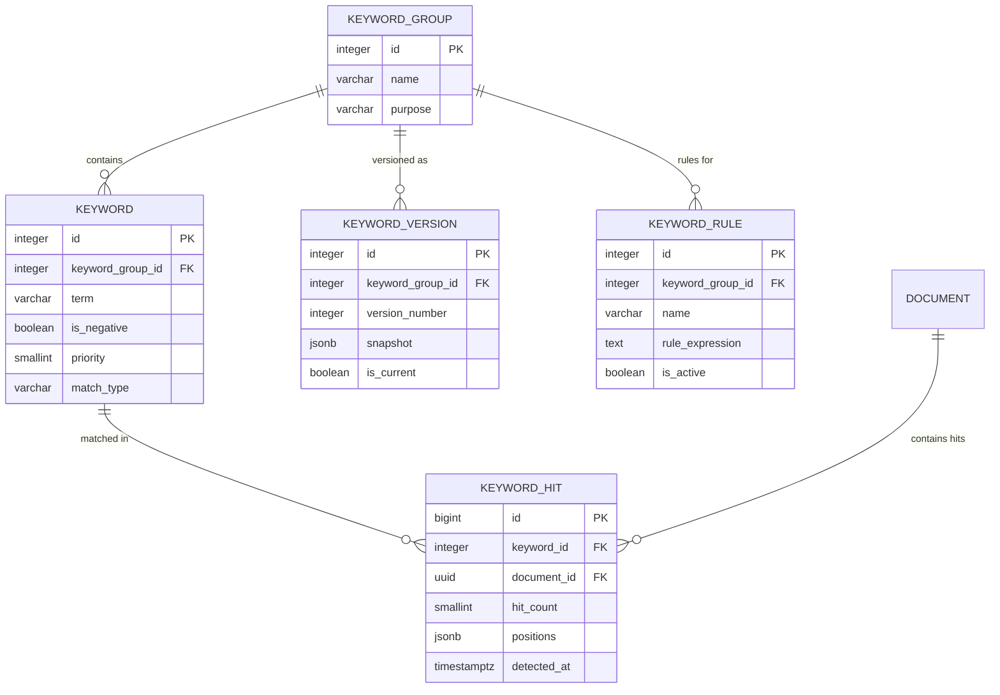

### Table Definitions

---

#### `keyword_group`

**Purpose:** Logical grouping of keywords by topic or purpose (e.g., "Kumbh Mela Terms", "Crowd Safety", "Infrastructure").

| Column | Type | Nullable | Default | Notes |
|---|---|---|---|---|
| `id` | SERIAL | NO | auto | PK |
| `name` | VARCHAR(255) | NO | — | Group name |
| `description` | TEXT | YES | — | — |
| `purpose` | VARCHAR(100) | YES | — | monitoring, alerting, classification |
| `is_deleted` | BOOLEAN | NO | FALSE | — |
| `created_at` | TIMESTAMPTZ | NO | NOW() | — |
| `updated_at` | TIMESTAMPTZ | NO | NOW() | — |

**PK:** `id`
**Unique:** `uq_keyword_group_name` on `(name) WHERE is_deleted = FALSE`

---

#### `keyword`

**Purpose:** Individual keyword within a group. Supports exact, partial, regex, and stem matching. Negative keywords exclude documents.

| Column | Type | Nullable | Default | Notes |
|---|---|---|---|---|
| `id` | SERIAL | NO | auto | PK |
| `keyword_group_id` | INTEGER | NO | — | FK → keyword_group |
| `term` | VARCHAR(500) | NO | — | The keyword text |
| `is_negative` | BOOLEAN | NO | FALSE | Exclude if matched |
| `priority` | SMALLINT | NO | 5 | 1=highest, 10=lowest |
| `match_type` | VARCHAR(20) | NO | 'exact' | exact, partial, regex, stem |
| `language_id` | SMALLINT | YES | — | FK → language |
| `is_deleted` | BOOLEAN | NO | FALSE | — |
| `created_at` | TIMESTAMPTZ | NO | NOW() | — |
| `updated_at` | TIMESTAMPTZ | NO | NOW() | — |

**PK:** `id`
**FK:** `keyword_group_id` → `keyword_group(id)`, `language_id` → `language(id)`
**Indexes:**
- `idx_keyword_group` on `(keyword_group_id)` — all keywords in a group
- `idx_keyword_term` on `(term)` — lookup by term
- `idx_keyword_priority` on `(keyword_group_id, priority)` — ordered by priority

---

#### `keyword_version`

**Purpose:** Snapshot of a keyword group at a point in time. The `snapshot` JSONB contains the full list of keywords and their settings. Enables rollback and audit.

| Column | Type | Nullable | Default | Notes |
|---|---|---|---|---|
| `id` | SERIAL | NO | auto | PK |
| `keyword_group_id` | INTEGER | NO | — | FK → keyword_group |
| `version_number` | INTEGER | NO | — | Monotonically increasing |
| `snapshot` | JSONB | NO | — | Full keyword list at this point |
| `is_current` | BOOLEAN | NO | FALSE | — |
| `activated_at` | TIMESTAMPTZ | YES | — | — |
| `notes` | TEXT | YES | — | Changelog |
| `created_at` | TIMESTAMPTZ | NO | NOW() | — |
| `created_by` | UUID | YES | — | — |

**PK:** `id`
**FK:** `keyword_group_id` → `keyword_group(id)`
**Unique:** `uq_keyword_version` on `(keyword_group_id, version_number)`

---

#### `keyword_rule`

**Purpose:** Boolean expressions combining keywords for complex matching logic. Example: `"stampede" AND ("Kumbh" OR "Maha Kumbh") NOT "drill"`.

| Column | Type | Nullable | Default | Notes |
|---|---|---|---|---|
| `id` | SERIAL | NO | auto | PK |
| `keyword_group_id` | INTEGER | NO | — | FK → keyword_group |
| `name` | VARCHAR(255) | YES | — | Human-readable rule name |
| `rule_expression` | TEXT | NO | — | Boolean expression |
| `description` | TEXT | YES | — | What the rule detects |
| `is_active` | BOOLEAN | NO | TRUE | — |
| `is_deleted` | BOOLEAN | NO | FALSE | — |
| `created_at` | TIMESTAMPTZ | NO | NOW() | — |
| `updated_at` | TIMESTAMPTZ | NO | NOW() | — |

**PK:** `id`
**FK:** `keyword_group_id` → `keyword_group(id)`

---

#### `keyword_hit`

**Purpose:** Records where each keyword was found in a document. High-volume table.

| Column | Type | Nullable | Default | Notes |
|---|---|---|---|---|
| `id` | BIGSERIAL | NO | auto | PK |
| `keyword_id` | INTEGER | NO | — | FK → keyword |
| `document_id` | UUID | NO | — | FK → document |
| `hit_count` | SMALLINT | NO | 1 | Number of occurrences |
| `positions` | JSONB | YES | — | Array of character offsets |
| `matched_text` | VARCHAR(500) | YES | — | Actual matched text (may differ from keyword for partial/stem matches) |
| `context_snippet` | TEXT | YES | — | Surrounding text |
| `detected_at` | TIMESTAMPTZ | NO | NOW() | — |

**PK:** `id`
**FK:** `keyword_id` → `keyword(id)`, `document_id` → `document(id)`
**Indexes:**
- `idx_keyword_hit_keyword` on `(keyword_id)` — all hits for a keyword
- `idx_keyword_hit_document` on `(document_id)` — all keyword matches in a doc
- `idx_keyword_hit_detected` on `(detected_at)` — time-range queries, partition key

**Partitioning candidate:** Monthly range on `detected_at`.

---

### Module 8 — Relationship Summary

| Relationship | Cardinality | Reason |
|---|---|---|
| keyword_group → keyword | 1:N | A group contains multiple keywords |
| keyword_group → keyword_version | 1:N | Versioned snapshots of the group |
| keyword_group → keyword_rule | 1:N | Boolean rules combining keywords |
| keyword → keyword_hit | 1:N | A keyword is matched in many documents |
| document → keyword_hit | 1:N | A document may match many keywords |

---

## Module 9 — Classification Results

### Purpose

Detailed AI classification outputs for each document. While Module 5 stores which taxonomy node a document is classified under, this module stores the full richness of classification: theme, genre, event type, stakeholders, outcomes, evidence, and validation status.

### ER Diagram

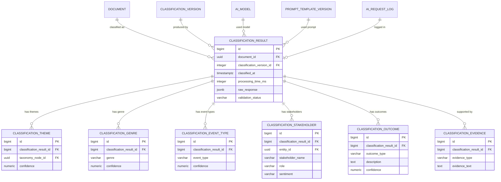

### Table Definitions

---

#### `classification_result`

**Purpose:** Master record for each AI classification run on a document. Links to the classification version (taxonomy + prompt + model combination), stores timing, raw response, and validation status.

| Column | Type | Nullable | Default | Notes |
|---|---|---|---|---|
| `id` | BIGSERIAL | NO | auto | PK |
| `document_id` | UUID | NO | — | FK → document |
| `classification_version_id` | INTEGER | NO | — | FK → classification_version |
| `classified_at` | TIMESTAMPTZ | NO | NOW() | — |
| `processing_time_ms` | INTEGER | YES | — | End-to-end classification time |
| `model_id` | INTEGER | YES | — | FK → ai_model |
| `prompt_version_id` | INTEGER | YES | — | FK → prompt_template_version |
| `ai_request_log_id` | BIGINT | YES | — | FK → ai_request_log |
| `raw_response` | JSONB | YES | — | Full AI response for debugging |
| `is_valid` | BOOLEAN | NO | TRUE | — |
| `validation_status` | VARCHAR(20) | NO | 'pending' | pending, approved, rejected, auto_approved |
| `validated_by` | UUID | YES | — | — |
| `validated_at` | TIMESTAMPTZ | YES | — | — |

**PK:** `id`
**FK:** `document_id` → `document(id)`, `classification_version_id` → `classification_version(id)`, `model_id` → `ai_model(id)`, `prompt_version_id` → `prompt_template_version(id)`, `ai_request_log_id` → `ai_request_log(id)`
**Indexes:**
- `idx_classification_result_document` on `(document_id)` — all classifications for a doc
- `idx_classification_result_version` on `(classification_version_id)` — all results for a config
- `idx_classification_result_classified` on `(classified_at)` — time-range, partition key
- `idx_classification_result_validation` on `(validation_status) WHERE validation_status = 'pending'` — review queue

**Partitioning candidate:** Monthly range on `classified_at`.

---

#### `classification_theme`

**Purpose:** The taxonomy nodes assigned to the document by classification. Multiple themes per result (multi-label classification).

| Column | Type | Nullable | Default | Notes |
|---|---|---|---|---|
| `id` | BIGSERIAL | NO | auto | PK |
| `classification_result_id` | BIGINT | NO | — | FK → classification_result |
| `taxonomy_node_id` | UUID | NO | — | FK → taxonomy_node |
| `confidence` | NUMERIC(5,4) | YES | — | 0.0000–1.0000 |
| `evidence_text` | TEXT | YES | — | Supporting quote from article |

**PK:** `id`
**FK:** `classification_result_id` → `classification_result(id)`, `taxonomy_node_id` → `taxonomy_node(id)`
**Indexes:** `idx_theme_result` on `(classification_result_id)`, `idx_theme_node` on `(taxonomy_node_id)`

---

#### `classification_genre`

**Purpose:** What type of journalism: news_report, opinion, analysis, press_release, interview, feature, editorial, fact_check, satire.

| Column | Type | Nullable | Default | Notes |
|---|---|---|---|---|
| `id` | BIGSERIAL | NO | auto | PK |
| `classification_result_id` | BIGINT | NO | — | FK → classification_result |
| `genre` | VARCHAR(100) | NO | — | Genre label |
| `confidence` | NUMERIC(5,4) | YES | — | — |

**PK:** `id`
**FK:** `classification_result_id` → `classification_result(id)`

---

#### `classification_event_type`

**Purpose:** What type of event the article covers (parallel to event_type_lookup but as an AI classification output).

| Column | Type | Nullable | Default | Notes |
|---|---|---|---|---|
| `id` | BIGSERIAL | NO | auto | PK |
| `classification_result_id` | BIGINT | NO | — | FK → classification_result |
| `event_type` | VARCHAR(100) | NO | — | — |
| `confidence` | NUMERIC(5,4) | YES | — | — |

**PK:** `id`
**FK:** `classification_result_id` → `classification_result(id)`

---

#### `classification_stakeholder`

**Purpose:** Key actors identified in the article with their roles and sentiment.

| Column | Type | Nullable | Default | Notes |
|---|---|---|---|---|
| `id` | BIGSERIAL | NO | auto | PK |
| `classification_result_id` | BIGINT | NO | — | FK → classification_result |
| `entity_id` | UUID | YES | — | FK → entity (resolved, nullable) |
| `stakeholder_name` | VARCHAR(500) | NO | — | Name as classified (may not be resolved to entity) |
| `role` | VARCHAR(100) | YES | — | protagonist, affected_party, authority, commentator, witness |
| `sentiment` | VARCHAR(20) | YES | — | positive, negative, neutral, mixed |
| `confidence` | NUMERIC(5,4) | YES | — | — |

**PK:** `id`
**FK:** `classification_result_id` → `classification_result(id)`, `entity_id` → `entity(id)`
**Indexes:** `idx_stakeholder_entity` on `(entity_id) WHERE entity_id IS NOT NULL`

---

#### `classification_outcome`

**Purpose:** What outcomes or actions are described in the article (policy_change, arrest, protest, announcement, legislation, funding).

| Column | Type | Nullable | Default | Notes |
|---|---|---|---|---|
| `id` | BIGSERIAL | NO | auto | PK |
| `classification_result_id` | BIGINT | NO | — | FK → classification_result |
| `outcome_type` | VARCHAR(100) | NO | — | — |
| `description` | TEXT | YES | — | — |
| `confidence` | NUMERIC(5,4) | YES | — | — |

**PK:** `id`
**FK:** `classification_result_id` → `classification_result(id)`

---

#### `classification_evidence`

**Purpose:** Supporting evidence extracted from the article — quotes, statistics, source references that justify the classification.

| Column | Type | Nullable | Default | Notes |
|---|---|---|---|---|
| `id` | BIGSERIAL | NO | auto | PK |
| `classification_result_id` | BIGINT | NO | — | FK → classification_result |
| `evidence_type` | VARCHAR(50) | NO | — | quote, statistic, source_reference, fact, data_point |
| `evidence_text` | TEXT | NO | — | The extracted evidence |
| `location_in_document` | INTEGER | YES | — | Paragraph number or character offset |

**PK:** `id`
**FK:** `classification_result_id` → `classification_result(id)`

---

### Module 9 — Relationship Summary

| Relationship | Cardinality | Reason |
|---|---|---|
| document → classification_result | 1:N | A document is classified multiple times (different versions) |
| classification_version → classification_result | 1:N | A config produces many results |
| classification_result → classification_theme | 1:N | Multi-label theme assignment |
| classification_result → classification_genre | 1:N | Could be classified as multiple genres |
| classification_result → classification_event_type | 1:N | Multiple event types possible |
| classification_result → classification_stakeholder | 1:N | Multiple stakeholders per article |
| classification_result → classification_outcome | 1:N | Multiple outcomes |
| classification_result → classification_evidence | 1:N | Supporting evidence fragments |
| classification_stakeholder → entity | M:1 (optional) | Stakeholder may be resolved to known entity |

---

## Module 10 — AI Operations

### Purpose

Comprehensive tracking of all AI/LLM interactions: which models are available, every API call made, token consumption, costs, failures, and retries. Critical for cost management, performance monitoring, and debugging.

### ER Diagram

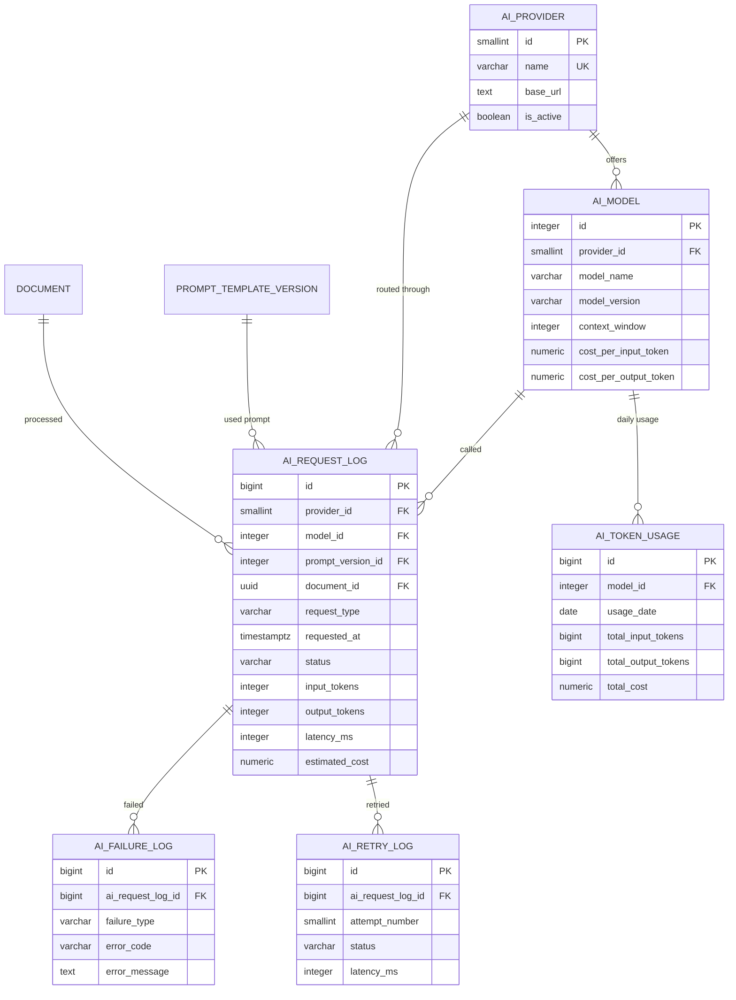

### Table Definitions

---

#### `ai_provider`

**Purpose:** AI service providers (OpenRouter, OpenAI, Anthropic, Google, local inference servers).

| Column | Type | Nullable | Default | Notes |
|---|---|---|---|---|
| `id` | SMALLSERIAL | NO | auto | PK |
| `name` | VARCHAR(100) | NO | — | UNIQUE |
| `base_url` | TEXT | YES | — | API endpoint |
| `is_active` | BOOLEAN | NO | TRUE | — |
| `metadata` | JSONB | YES | — | Provider-specific config |
| `is_deleted` | BOOLEAN | NO | FALSE | — |
| `created_at` | TIMESTAMPTZ | NO | NOW() | — |
| `updated_at` | TIMESTAMPTZ | NO | NOW() | — |

**PK:** `id`
**Unique:** `uq_ai_provider_name` on `(name)`

---

#### `ai_model`

**Purpose:** Available models with their pricing. Pricing is stored per-model because it varies by provider and model version.

| Column | Type | Nullable | Default | Notes |
|---|---|---|---|---|
| `id` | SERIAL | NO | auto | PK |
| `provider_id` | SMALLINT | NO | — | FK → ai_provider |
| `model_name` | VARCHAR(255) | NO | — | e.g., "gpt-4o", "claude-sonnet-4-20250514" |
| `model_version` | VARCHAR(50) | YES | — | Version tag |
| `context_window` | INTEGER | YES | — | Max tokens |
| `cost_per_input_token` | NUMERIC(12,10) | YES | — | USD per token |
| `cost_per_output_token` | NUMERIC(12,10) | YES | — | USD per token |
| `capabilities` | JSONB | YES | — | Supported tasks list |
| `is_active` | BOOLEAN | NO | TRUE | — |
| `is_deleted` | BOOLEAN | NO | FALSE | — |
| `created_at` | TIMESTAMPTZ | NO | NOW() | — |
| `updated_at` | TIMESTAMPTZ | NO | NOW() | — |

**PK:** `id`
**FK:** `provider_id` → `ai_provider(id)`
**Unique:** `uq_ai_model` on `(provider_id, model_name, model_version)`

---

#### `ai_request_log`

**Purpose:** Every AI API call. The highest-volume table in Module 10. Insert-only.

| Column | Type | Nullable | Default | Notes |
|---|---|---|---|---|
| `id` | BIGSERIAL | NO | auto | PK |
| `provider_id` | SMALLINT | NO | — | FK → ai_provider |
| `model_id` | INTEGER | NO | — | FK → ai_model |
| `prompt_version_id` | INTEGER | YES | — | FK → prompt_template_version |
| `document_id` | UUID | YES | — | FK → document (if document-specific) |
| `request_type` | VARCHAR(50) | NO | — | classification, extraction, summarization, event_detection, embedding |
| `requested_at` | TIMESTAMPTZ | NO | NOW() | — |
| `completed_at` | TIMESTAMPTZ | YES | — | — |
| `status` | VARCHAR(20) | NO | 'pending' | pending, success, failed, timeout, rate_limited |
| `input_tokens` | INTEGER | YES | — | — |
| `output_tokens` | INTEGER | YES | — | — |
| `total_tokens` | INTEGER | YES | — | — |
| `latency_ms` | INTEGER | YES | — | — |
| `estimated_cost` | NUMERIC(10,6) | YES | — | USD |
| `request_payload_hash` | VARCHAR(64) | YES | — | For caching/dedup |
| `response_truncated` | TEXT | YES | — | First 500 chars for debugging |
| `error_code` | VARCHAR(50) | YES | — | — |
| `error_message` | TEXT | YES | — | — |

**PK:** `id`
**FK:** `provider_id` → `ai_provider(id)`, `model_id` → `ai_model(id)`, `prompt_version_id` → `prompt_template_version(id)`, `document_id` → `document(id)`
**Indexes:**
- `idx_ai_request_requested_at` on `(requested_at)` — partition key, time queries
- `idx_ai_request_model_status` on `(model_id, status)` — failure rate per model
- `idx_ai_request_document` on `(document_id) WHERE document_id IS NOT NULL` — all AI work for a doc
- `idx_ai_request_type_status` on `(request_type, status)` — pipeline monitoring
- `idx_ai_request_payload_hash` on `(request_payload_hash) WHERE request_payload_hash IS NOT NULL` — cache lookup

**Partitioning candidate:** Monthly range on `requested_at`.

---

#### `ai_token_usage`

**Purpose:** Pre-aggregated daily token/cost summary per model. Avoids scanning `ai_request_log` for dashboards.

| Column | Type | Nullable | Default | Notes |
|---|---|---|---|---|
| `id` | BIGSERIAL | NO | auto | PK |
| `model_id` | INTEGER | NO | — | FK → ai_model |
| `usage_date` | DATE | NO | — | — |
| `total_requests` | INTEGER | NO | 0 | — |
| `total_input_tokens` | BIGINT | NO | 0 | — |
| `total_output_tokens` | BIGINT | NO | 0 | — |
| `total_cost` | NUMERIC(10,4) | NO | 0 | USD |

**PK:** `id`
**FK:** `model_id` → `ai_model(id)`
**Unique:** `uq_ai_token_usage` on `(model_id, usage_date)`

---

#### `ai_failure_log`

**Purpose:** Detailed failure records linked to specific AI requests.

| Column | Type | Nullable | Default | Notes |
|---|---|---|---|---|
| `id` | BIGSERIAL | NO | auto | PK |
| `ai_request_log_id` | BIGINT | NO | — | FK → ai_request_log |
| `failure_type` | VARCHAR(50) | NO | — | timeout, rate_limit, invalid_response, parse_error, api_error, auth_error |
| `error_code` | VARCHAR(50) | YES | — | — |
| `error_message` | TEXT | YES | — | — |
| `http_status_code` | SMALLINT | YES | — | — |
| `occurred_at` | TIMESTAMPTZ | NO | NOW() | — |
| `request_payload` | JSONB | YES | — | For debugging (may be redacted) |

**PK:** `id`
**FK:** `ai_request_log_id` → `ai_request_log(id)`
**Indexes:** `idx_ai_failure_request` on `(ai_request_log_id)`, `idx_ai_failure_type` on `(failure_type, occurred_at DESC)`

---

#### `ai_retry_log`

**Purpose:** Records each retry attempt for a failed AI request.

| Column | Type | Nullable | Default | Notes |
|---|---|---|---|---|
| `id` | BIGSERIAL | NO | auto | PK |
| `ai_request_log_id` | BIGINT | NO | — | FK → ai_request_log |
| `attempt_number` | SMALLINT | NO | — | 1-based |
| `attempted_at` | TIMESTAMPTZ | NO | — | — |
| `status` | VARCHAR(20) | NO | — | success, failed |
| `latency_ms` | INTEGER | YES | — | — |
| `error_message` | TEXT | YES | — | — |

**PK:** `id`
**FK:** `ai_request_log_id` → `ai_request_log(id)`
**Indexes:** `idx_ai_retry_request` on `(ai_request_log_id, attempt_number)`

---

### Module 10 — Relationship Summary

| Relationship | Cardinality | Reason |
|---|---|---|
| ai_provider → ai_model | 1:N | A provider offers multiple models |
| ai_model → ai_request_log | 1:N | A model handles many requests |
| ai_provider → ai_request_log | 1:N | Requests are routed through providers |
| ai_request_log → ai_failure_log | 1:N | A request may fail in multiple ways |
| ai_request_log → ai_retry_log | 1:N | A request may be retried multiple times |
| ai_model → ai_token_usage | 1:N | Daily aggregated usage per model |
| document → ai_request_log | 1:N | A document may trigger multiple AI calls |
| prompt_template_version → ai_request_log | 1:N | A prompt version is used in many requests |

---

## Module 11 — Knowledge Graph Preparation

### Purpose

Tables designed to project entities, events, and documents into a graph structure that can be exported to Neo4j or queried within PostgreSQL. These tables act as a staging layer — populated asynchronously from Modules 4, 6, and 3 — enabling graph queries without requiring a separate graph database immediately.

### ER Diagram

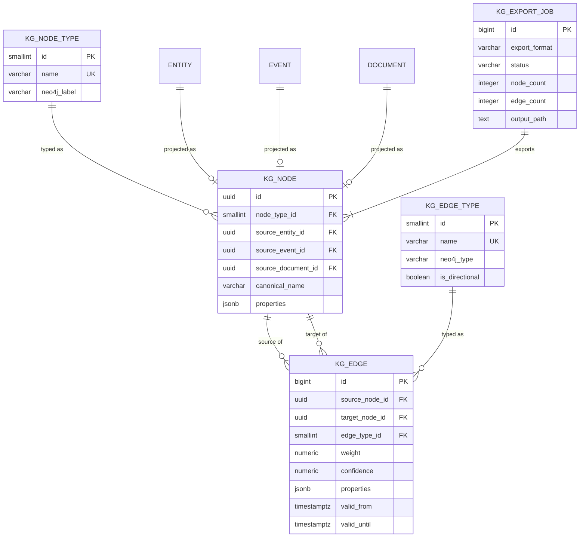

### Table Definitions

---

#### `kg_node_type`

**Purpose:** Node type labels for the knowledge graph: Person, Organization, Location, Event, Document, Concept, Policy, Legislation.

| Column | Type | Nullable | Default | Notes |
|---|---|---|---|---|
| `id` | SMALLSERIAL | NO | auto | PK |
| `name` | VARCHAR(100) | NO | — | UNIQUE — internal label |
| `description` | TEXT | YES | — | — |
| `neo4j_label` | VARCHAR(100) | YES | — | Label for Neo4j export |
| `created_at` | TIMESTAMPTZ | NO | NOW() | — |

**PK:** `id`
**Unique:** `uq_kg_node_type_name` on `(name)`

---

#### `kg_node`

**Purpose:** Every graph node. Linked back to its source entity, event, or document via nullable FK. The `properties` JSONB carries type-specific attributes (e.g., for a Person: age, party, constituency).

| Column | Type | Nullable | Default | Notes |
|---|---|---|---|---|
| `id` | UUID | NO | gen_random_uuid() | PK |
| `node_type_id` | SMALLINT | NO | — | FK → kg_node_type |
| `source_entity_id` | UUID | YES | — | FK → entity (from Module 6) |
| `source_event_id` | UUID | YES | — | FK → event (from Module 4) |
| `source_document_id` | UUID | YES | — | FK → document (from Module 3) |
| `canonical_name` | VARCHAR(500) | NO | — | Display label |
| `properties` | JSONB | YES | — | Type-specific properties |
| `is_deleted` | BOOLEAN | NO | FALSE | — |
| `created_at` | TIMESTAMPTZ | NO | NOW() | — |
| `updated_at` | TIMESTAMPTZ | NO | NOW() | — |

**PK:** `id`
**FK:** `node_type_id` → `kg_node_type(id)`, `source_entity_id` → `entity(id)`, `source_event_id` → `event(id)`, `source_document_id` → `document(id)`
**Check:** At most one of `source_entity_id`, `source_event_id`, `source_document_id` is NOT NULL (application-enforced or CHECK constraint).
**Indexes:**
- `idx_kg_node_type` on `(node_type_id)`
- `idx_kg_node_entity` on `(source_entity_id) WHERE source_entity_id IS NOT NULL`
- `idx_kg_node_event` on `(source_event_id) WHERE source_event_id IS NOT NULL`
- `idx_kg_node_document` on `(source_document_id) WHERE source_document_id IS NOT NULL`
- `idx_kg_node_name_trgm` — GIN trigram for fuzzy search

---

#### `kg_edge_type`

**Purpose:** Edge/relationship type registry for the graph.

| Column | Type | Nullable | Default | Notes |
|---|---|---|---|---|
| `id` | SMALLSERIAL | NO | auto | PK |
| `name` | VARCHAR(100) | NO | — | UNIQUE |
| `description` | TEXT | YES | — | — |
| `neo4j_type` | VARCHAR(100) | YES | — | Relationship type for Neo4j export |
| `is_directional` | BOOLEAN | NO | TRUE | — |
| `created_at` | TIMESTAMPTZ | NO | NOW() | — |

**PK:** `id`
**Unique:** `uq_kg_edge_type_name` on `(name)`

---

#### `kg_edge`

**Purpose:** Every graph edge. Connects two nodes with a typed, weighted, temporal relationship.

| Column | Type | Nullable | Default | Notes |
|---|---|---|---|---|
| `id` | BIGSERIAL | NO | auto | PK |
| `source_node_id` | UUID | NO | — | FK → kg_node |
| `target_node_id` | UUID | NO | — | FK → kg_node |
| `edge_type_id` | SMALLINT | NO | — | FK → kg_edge_type |
| `weight` | NUMERIC(5,4) | NO | 1.0 | Edge weight/strength |
| `confidence` | NUMERIC(5,4) | YES | — | AI extraction confidence |
| `properties` | JSONB | YES | — | Edge-specific attributes |
| `valid_from` | TIMESTAMPTZ | YES | — | Temporal validity start |
| `valid_until` | TIMESTAMPTZ | YES | — | Temporal validity end |
| `source_document_id` | UUID | YES | — | FK → document (provenance) |
| `is_deleted` | BOOLEAN | NO | FALSE | — |
| `created_at` | TIMESTAMPTZ | NO | NOW() | — |
| `updated_at` | TIMESTAMPTZ | NO | NOW() | — |

**PK:** `id`
**FK:** `source_node_id` → `kg_node(id)`, `target_node_id` → `kg_node(id)`, `edge_type_id` → `kg_edge_type(id)`, `source_document_id` → `document(id)`
**Check:** `source_node_id != target_node_id`
**Indexes:**
- `idx_kg_edge_source` on `(source_node_id)` — outbound edges
- `idx_kg_edge_target` on `(target_node_id)` — inbound edges
- `idx_kg_edge_type` on `(edge_type_id)` — edges by type
- `idx_kg_edge_source_target_type` on `(source_node_id, target_node_id, edge_type_id)` — specific relationship lookup

**Neo4j export pattern:** Export jobs query `kg_node` and `kg_edge` with their types, generate CSV files in Neo4j import format (`:ID`, `:LABEL`, `:START_ID`, `:END_ID`, `:TYPE`), and load via `neo4j-admin import`.

---

#### `kg_export_job`

**Purpose:** Records of graph export operations for auditing and reproducibility.

| Column | Type | Nullable | Default | Notes |
|---|---|---|---|---|
| `id` | BIGSERIAL | NO | auto | PK |
| `export_format` | VARCHAR(50) | NO | — | neo4j_csv, graphml, rdf, json_ld |
| `status` | VARCHAR(20) | NO | 'pending' | pending, running, completed, failed |
| `started_at` | TIMESTAMPTZ | YES | — | — |
| `completed_at` | TIMESTAMPTZ | YES | — | — |
| `node_count` | INTEGER | YES | — | Nodes exported |
| `edge_count` | INTEGER | YES | — | Edges exported |
| `output_path` | TEXT | YES | — | File path or object storage reference |
| `error_message` | TEXT | YES | — | — |
| `filters` | JSONB | YES | — | What subset was exported |
| `created_at` | TIMESTAMPTZ | NO | NOW() | — |
| `created_by` | UUID | YES | — | — |

**PK:** `id`

---

### Module 11 — Relationship Summary

| Relationship | Cardinality | Reason |
|---|---|---|
| kg_node_type → kg_node | 1:N | Every node has a type |
| entity → kg_node | 1:1 (optional) | An entity is projected into the graph as a node |
| event → kg_node | 1:1 (optional) | An event is projected as a node |
| document → kg_node | 1:1 (optional) | A document can be a node in the graph |
| kg_node ↔ kg_node | M:N via kg_edge | Typed, temporal graph edges |
| kg_edge_type → kg_edge | 1:N | Every edge has a type |

**Why separate from Module 6 entities?** Module 6 entities are extracted from NER — operational data. Module 11 KG nodes are curated projections optimized for graph traversal and export. Not every entity becomes a KG node, and KG nodes can be created from events and documents too. This separation allows the KG to evolve independently.

---

## Module 12 — Analytics

### Purpose

Pre-aggregated statistics tables for dashboard performance. These tables are populated by scheduled jobs that summarize data from operational tables. They trade normalization for query speed — an intentional design decision for read-heavy analytics workloads.

### ER Diagram

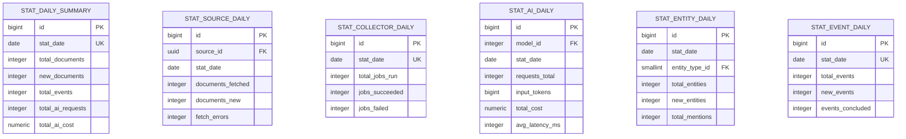

### Table Definitions

---

#### `stat_daily_summary`

**Purpose:** Platform-wide daily snapshot. Single source-of-truth for "what happened today."

| Column | Type | Nullable | Default | Notes |
|---|---|---|---|---|
| `id` | BIGSERIAL | NO | auto | PK |
| `stat_date` | DATE | NO | — | The day |
| `total_documents` | INTEGER | NO | 0 | Cumulative |
| `new_documents` | INTEGER | NO | 0 | Added this day |
| `total_events` | INTEGER | NO | 0 | Cumulative |
| `new_events` | INTEGER | NO | 0 | — |
| `total_entities` | INTEGER | NO | 0 | — |
| `new_entities` | INTEGER | NO | 0 | — |
| `total_classifications` | INTEGER | NO | 0 | — |
| `total_ai_requests` | INTEGER | NO | 0 | — |
| `total_ai_cost` | NUMERIC(10,4) | NO | 0 | USD |
| `total_sources_active` | INTEGER | NO | 0 | — |
| `total_sources_failing` | INTEGER | NO | 0 | — |

**PK:** `id`
**Unique:** `uq_stat_daily_date` on `(stat_date)`

---

#### `stat_source_daily`

**Purpose:** Per-source daily performance metrics.

| Column | Type | Nullable | Default | Notes |
|---|---|---|---|---|
| `id` | BIGSERIAL | NO | auto | PK |
| `source_id` | UUID | NO | — | FK → source |
| `stat_date` | DATE | NO | — | — |
| `documents_fetched` | INTEGER | NO | 0 | — |
| `documents_new` | INTEGER | NO | 0 | — |
| `documents_duplicate` | INTEGER | NO | 0 | — |
| `fetch_errors` | INTEGER | NO | 0 | — |
| `avg_response_time_ms` | INTEGER | YES | — | — |
| `health_check_count` | INTEGER | NO | 0 | — |
| `health_check_failures` | INTEGER | NO | 0 | — |

**PK:** `id`
**FK:** `source_id` → `source(id)`
**Unique:** `uq_stat_source_daily` on `(source_id, stat_date)`

---

#### `stat_collector_daily`

**Purpose:** Daily collection system performance.

| Column | Type | Nullable | Default | Notes |
|---|---|---|---|---|
| `id` | BIGSERIAL | NO | auto | PK |
| `stat_date` | DATE | NO | — | — |
| `total_jobs_run` | INTEGER | NO | 0 | — |
| `jobs_succeeded` | INTEGER | NO | 0 | — |
| `jobs_failed` | INTEGER | NO | 0 | — |
| `total_items_fetched` | INTEGER | NO | 0 | — |
| `total_retries` | INTEGER | NO | 0 | — |
| `avg_job_duration_ms` | INTEGER | YES | — | — |

**PK:** `id`
**Unique:** `uq_stat_collector_daily` on `(stat_date)`

---

#### `stat_ai_daily`

**Purpose:** Per-model daily AI performance and cost metrics.

| Column | Type | Nullable | Default | Notes |
|---|---|---|---|---|
| `id` | BIGSERIAL | NO | auto | PK |
| `model_id` | INTEGER | NO | — | FK → ai_model |
| `stat_date` | DATE | NO | — | — |
| `requests_total` | INTEGER | NO | 0 | — |
| `requests_succeeded` | INTEGER | NO | 0 | — |
| `requests_failed` | INTEGER | NO | 0 | — |
| `input_tokens` | BIGINT | NO | 0 | — |
| `output_tokens` | BIGINT | NO | 0 | — |
| `total_cost` | NUMERIC(10,4) | NO | 0 | USD |
| `avg_latency_ms` | INTEGER | YES | — | — |
| `p95_latency_ms` | INTEGER | YES | — | — |

**PK:** `id`
**FK:** `model_id` → `ai_model(id)`
**Unique:** `uq_stat_ai_daily` on `(model_id, stat_date)`

---

#### `stat_entity_daily`

**Purpose:** Per-entity-type daily counts.

| Column | Type | Nullable | Default | Notes |
|---|---|---|---|---|
| `id` | BIGSERIAL | NO | auto | PK |
| `stat_date` | DATE | NO | — | — |
| `entity_type_id` | SMALLINT | NO | — | FK → entity_type |
| `total_entities` | INTEGER | NO | 0 | Cumulative |
| `new_entities` | INTEGER | NO | 0 | Added this day |
| `total_mentions` | INTEGER | NO | 0 | Mentions this day |

**PK:** `id`
**FK:** `entity_type_id` → `entity_type(id)`
**Unique:** `uq_stat_entity_daily` on `(stat_date, entity_type_id)`

---

#### `stat_event_daily`

**Purpose:** Daily event lifecycle metrics.

| Column | Type | Nullable | Default | Notes |
|---|---|---|---|---|
| `id` | BIGSERIAL | NO | auto | PK |
| `stat_date` | DATE | NO | — | — |
| `total_events` | INTEGER | NO | 0 | Cumulative |
| `new_events` | INTEGER | NO | 0 | — |
| `events_concluded` | INTEGER | NO | 0 | — |
| `events_merged` | INTEGER | NO | 0 | — |
| `avg_documents_per_event` | NUMERIC(5,2) | YES | — | — |

**PK:** `id`
**Unique:** `uq_stat_event_daily` on `(stat_date)`

---

### Materialized Views

The following materialized views should be created and refreshed on schedule. They are not tables — they are computed projections for dashboard performance.

| View Name | Refresh Frequency | Source Tables | Purpose |
|---|---|---|---|
| `mv_top_entities_30d` | Every 6 hours | entity_mention, entity | Top 100 most-mentioned entities in last 30 days |
| `mv_top_events_7d` | Every 1 hour | event, document_event | Top 50 active events with document counts in last 7 days |
| `mv_source_reliability` | Every 24 hours | source, stat_source_daily | Source reliability scores based on health and fetch success rates |
| `mv_taxonomy_coverage` | Every 24 hours | classification_record, taxonomy_node | Percentage of documents classified per taxonomy node |
| `mv_event_timeline` | Every 2 hours | event, event_timeline_entry, document_event | Flattened timeline of major events with article counts |
| `mv_entity_network` | Every 12 hours | entity_relationship, entity | Top entity-to-entity relationships by frequency and confidence |
| `mv_keyword_trends_7d` | Every 6 hours | keyword_hit, keyword | Keyword hit counts and trends over 7 days |

---

### Module 12 — Relationship Summary

| Relationship | Cardinality | Reason |
|---|---|---|
| stat_source_daily → source | M:1 | Daily stats per source |
| stat_ai_daily → ai_model | M:1 | Daily stats per model |
| stat_entity_daily → entity_type | M:1 | Daily stats per entity type |

All analytics tables are insert-only (one row per day per dimension) and updated via `INSERT ... ON CONFLICT UPDATE` (upsert) as aggregation jobs run.

---

---

# Indexing Strategy

## Philosophy

Indexes are designed around query patterns, not tables. Every index has a documented reason for existing. Unused indexes waste write performance and storage.

### Index Types Used

| Index Type | When to Use | PostgreSQL Syntax |
|---|---|---|
| **B-tree** (default) | Equality, range, sorting, `ORDER BY` | `CREATE INDEX` |
| **GIN** | Full-text search, JSONB containment, array membership, trigram similarity | `CREATE INDEX ... USING GIN` |
| **GiST** | Geospatial (PostGIS), range types, nearest-neighbor | `CREATE INDEX ... USING GiST` |
| **BRIN** | Large, naturally ordered tables (time-series) where rows are physically ordered | `CREATE INDEX ... USING BRIN` |
| **Partial** | Subset of rows matching a `WHERE` condition | `CREATE INDEX ... WHERE condition` |

### Index Catalog

#### Articles (document table)

| Index | Type | Columns | Rationale |
|---|---|---|---|
| `idx_document_source_published` | B-tree | `(source_id, published_at DESC)` | "Latest articles from source X" — primary dashboard query |
| `idx_document_published_at` | B-tree | `(published_at DESC)` | Global timeline, date range filters |
| `idx_document_discovered_at` | B-tree | `(discovered_at DESC)` | Processing pipeline ordered by ingestion time |
| `idx_document_language` | B-tree | `(language_id)` | Filter by language |
| `idx_document_canonical_url` | B-tree | `(canonical_url_id)` | Find documents sharing a canonical URL (syndication) |
| `idx_document_title_trgm` | GIN | `(title gin_trgm_ops)` | Fuzzy title search with `%` similarity |
| `idx_document_content_fts` | GIN | `to_tsvector('english', content_plain)` | Full-text search across document content |
| `idx_document_metadata_gin` | GIN | `(metadata jsonb_path_ops)` | Query JSONB metadata attributes |
| `idx_document_not_deleted` | Partial B-tree | `(id) WHERE is_deleted = FALSE` | Active documents only |

#### Entities

| Index | Type | Columns | Rationale |
|---|---|---|---|
| `idx_entity_type` | B-tree | `(entity_type_id)` | Filter by entity type (person, org, location) |
| `idx_entity_canonical_name` | B-tree | `(canonical_name)` | Exact name lookup |
| `idx_entity_name_trgm` | GIN | `(canonical_name gin_trgm_ops)` | Fuzzy name search |
| `idx_entity_wikidata` | Partial B-tree | `(wikidata_id) WHERE wikidata_id IS NOT NULL` | External ID resolution |
| `idx_entity_alias_alias` | B-tree | `(alias)` on entity_alias | Lookup by any known name |
| `idx_mention_entity` | B-tree | `(entity_id)` on entity_mention | All mentions of an entity |
| `idx_mention_document` | B-tree | `(document_id)` on entity_mention | All entities in a document |
| `idx_mention_entity_document` | B-tree | `(entity_id, document_id)` on entity_mention | Composite for co-occurrence queries |

#### Events

| Index | Type | Columns | Rationale |
|---|---|---|---|
| `idx_event_type` | B-tree | `(event_type_id)` | Filter by event type |
| `idx_event_status` | B-tree | `(status_id)` | Filter by lifecycle status |
| `idx_event_started_at` | B-tree | `(started_at DESC)` | Timeline queries |
| `idx_event_severity` | B-tree | `(severity)` | Priority-based filtering |
| `idx_event_ongoing` | Partial B-tree | `(id) WHERE is_ongoing = TRUE AND is_deleted = FALSE` | Active events dashboard |
| `idx_event_title_trgm` | GIN | `(title gin_trgm_ops)` | Fuzzy event title search |
| `idx_doc_event_event` | B-tree | `(event_id)` on document_event | All documents for an event |
| `idx_doc_event_document` | B-tree | `(document_id)` on document_event | All events for a document |
| `idx_timeline_event_occurred` | B-tree | `(event_id, occurred_at)` on event_timeline_entry | Chronological event timeline |

#### Taxonomy

| Index | Type | Columns | Rationale |
|---|---|---|---|
| `idx_taxonomy_node_version` | B-tree | `(taxonomy_version_id)` on taxonomy_node | All nodes for a version |
| `idx_taxonomy_node_parent` | B-tree | `(parent_node_id)` on taxonomy_node | Children of a node |
| `idx_closure_descendant` | B-tree | `(descendant_id)` on taxonomy_node_closure | All ancestors of a node |
| `idx_closure_ancestor_depth` | B-tree | `(ancestor_id, depth)` on taxonomy_node_closure | Descendants at specific depth |
| `idx_classification_document` | B-tree | `(document_id)` on classification_record | All classifications for a doc |
| `idx_classification_node` | B-tree | `(taxonomy_node_id)` on classification_record | All docs under a taxonomy node |

#### Search

| Index | Type | Columns | Rationale |
|---|---|---|---|
| `idx_document_content_fts` | GIN | `to_tsvector('english', content_plain)` on document | Full-text search |
| `idx_document_title_trgm` | GIN | `(title gin_trgm_ops)` on document | Fuzzy title search |
| `idx_entity_name_trgm` | GIN | `(canonical_name gin_trgm_ops)` on entity | Fuzzy entity search |
| `idx_event_title_trgm` | GIN | `(title gin_trgm_ops)` on event | Fuzzy event search |
| `idx_kg_node_name_trgm` | GIN | `(canonical_name gin_trgm_ops)` on kg_node | Graph node search |
| `idx_city_name_trgm` | GIN | `(name gin_trgm_ops)` on city | Fuzzy city search |

#### Time-Based Queries

| Index | Type | Columns | Rationale |
|---|---|---|---|
| `idx_raw_content_fetched_at` | BRIN | `(fetched_at)` on raw_content | Time-range scans on append-only data |
| `idx_fetch_log_fetched_at` | BRIN | `(fetched_at)` on fetch_log | Time-range scans |
| `idx_ai_request_requested_at` | BRIN | `(requested_at)` on ai_request_log | Time-range scans |
| `idx_keyword_hit_detected` | BRIN | `(detected_at)` on keyword_hit | Time-range scans |
| `idx_mention_created_at` | BRIN | `(created_at)` on entity_mention | Time-range scans |

> **Note:** BRIN indexes are used for time-series columns on large tables where data is physically inserted in chronological order. They are ~1000× smaller than B-tree indexes on the same columns and nearly as fast for range scans.

#### Duplicates

| Index | Type | Columns | Rationale |
|---|---|---|---|
| `idx_raw_content_hash` | B-tree | `(content_hash)` on raw_content | Exact content dedup at ingestion |
| `idx_fingerprint_type_value` | B-tree | `(fingerprint_type, fingerprint_value)` on document_fingerprint | Near-duplicate lookup by fingerprint |
| `idx_fetch_log_content_hash` | B-tree | `(content_hash)` on fetch_log | Detect re-fetching identical content |
| `uq_canonical_url_hash` | Unique B-tree | `(url_hash)` on canonical_url | URL-level dedup |

#### Analytics

| Index | Type | Columns | Rationale |
|---|---|---|---|
| All `stat_*` unique constraints | Unique B-tree | `(stat_date, ...)` | Natural access pattern: lookup by date + dimension |

No additional indexes needed — unique constraints create the necessary B-tree indexes, and these tables are small enough that seq scans are acceptable for aggregation queries.

---

# Partitioning Strategy

## Philosophy

Partition tables when they are expected to exceed tens of millions of rows AND are predominantly queried with a time-range predicate. Partitioning enables:

1. **Query pruning:** Only scan relevant partitions.
2. **Maintenance:** `VACUUM`, `REINDEX`, `ANALYZE` run per-partition.
3. **Archival:** Drop or detach old partitions without DELETE.
4. **Parallel scans:** Multiple partitions can be scanned concurrently.

## Partition Recommendations

| Table | Partition Type | Partition Key | Partition Size | Estimated Growth | Rationale |
|---|---|---|---|---|---|
| `raw_content` | Range | `fetched_at` | Monthly | ~500K rows/month | Large blobs, always queried by time |
| `document` | Range | `published_at` | Monthly | ~300K rows/month | Primary query pattern is date-filtered |
| `fetch_log` | Range | `fetched_at` | Monthly | ~2M rows/month | Very high volume, append-only |
| `collector_job_history` | Range | `started_at` | Monthly | ~500K rows/month | Append-only operational logs |
| `source_health_check` | Range | `checked_at` | Monthly | ~1M rows/month | High-frequency checks |
| `entity_mention` | Range | `created_at` | Monthly | ~5M rows/month | Highest volume entity table |
| `keyword_hit` | Range | `detected_at` | Monthly | ~3M rows/month | High-volume per-keyword tracking |
| `ai_request_log` | Range | `requested_at` | Monthly | ~1M rows/month | Every AI call logged |
| `classification_result` | Range | `classified_at` | Monthly | ~300K rows/month | Every classification logged |
| `event_timeline_entry` | Range | `occurred_at` | Monthly | ~100K rows/month | Timeline queries are time-bounded |

## Tables NOT Partitioned

| Table | Reason |
|---|---|
| `source`, `source_type`, `source_group` | Small (<10K rows), frequently joined |
| `document_version`, `document_fingerprint` | Moderate volume, no dominant time predicate |
| `event`, `event_relationship` | Moderate volume, queries not time-dominated |
| `entity`, `entity_alias`, `entity_relationship` | Moderate volume, lookups by entity ID |
| `taxonomy_*`, `classification_version` | Small, versioned data |
| `kg_node`, `kg_edge` | Moderate volume, graph queries by node ID |
| All `stat_*` tables | Small (one row per day per dimension) |
| All lookup tables | Tiny (<100 rows) |

## Partition Type Tradeoffs

| Type | When to Use | Pros | Cons |
|---|---|---|---|
| **Range** | Time-series data with range queries | Natural time pruning, easy archival | Uneven distribution possible |
| **Hash** | Even distribution needed, no range queries | Balanced writes | Cannot prune by range, no archival benefit |
| **List** | Discrete set of values (region, type) | Exact pruning | Must know all values upfront |

**Our choice: Range partitioning for all partitioned tables.** All high-volume tables have a strong time dimension, and queries almost always include a time filter. Hash partitioning would sacrifice the archival benefit (dropping old monthly partitions) for even distribution — a tradeoff not worth making for a time-series intelligence platform.

## Archival Strategy

Monthly partitions older than a configurable retention period (e.g., 24 months for logs, unlimited for documents/events) can be:

1. **Detached:** `ALTER TABLE ... DETACH PARTITION ...` — removes from query path but keeps data accessible.
2. **Exported:** Dump to Parquet/CSV and upload to object storage.
3. **Dropped:** After confirmed archival, `DROP TABLE partition_name`.

---

# Caching Strategy

## What to Cache

| Data | Cache Store | TTL | Invalidation Trigger |
|---|---|---|---|
| Taxonomy tree (current version) | Redis (hash) | 1 hour | Taxonomy version activated |
| Keyword groups (current version) | Redis (set per group) | 1 hour | Keyword version activated |
| Prompt templates (current versions) | Redis (hash) | 30 minutes | Prompt version activated |
| Source configurations (current) | Redis (hash per source) | 15 minutes | New config version activated |
| Entity dictionary (aliases → entity_id) | Redis (hash) | 6 hours | Entity created/merged/alias added |
| Active events (ongoing) | Redis (sorted set) | 5 minutes | Event status changed |
| Language lookup | Redis (hash) | 24 hours | Language added (rare) |
| Country/region/city lookup | Redis (hash) | 24 hours | Geo data modified (rare) |
| AI model pricing | Redis (hash) | 1 hour | Model pricing updated |
| Document dedup fingerprints (recent) | Redis (bloom filter) | 24 hours | Document added |

## Cache Invalidation Strategy

### Event-Driven Invalidation

When a row with `is_current` is activated or deactivated, the application publishes an invalidation event. Redis keys are deleted immediately, and the next read re-populates the cache.

```
Event: taxonomy_version_activated {taxonomy_id: 1, version_id: 5}
→ DELETE Redis key: taxonomy:tree:1
→ Next read triggers cache rebuild
```

### Time-Based Expiry (TTL)

All cached data has a TTL as a safety net. Even if an invalidation event is missed, stale data expires within the TTL window.

### Write-Through for Critical Data

For entity dictionary and document fingerprints, use **write-through caching**: new entries are written to both PostgreSQL and Redis simultaneously. This ensures the cache is always warm for dedup checks.

### Bloom Filter for Duplicate Detection

A Redis Bloom filter (using `ReBloom` module) for recent document content hashes enables O(1) dedup checks at ingestion time. False positives fall through to PostgreSQL for confirmation. False negatives are impossible — guaranteeing no duplicate is missed.

---

# Storage Strategy

## Data Placement

```
┌──────────────────────────────────────────────────────────────────┐
│                        PostgreSQL                                 │
│                                                                    │
│  ● All transactional tables (Modules 1-12)                        │
│  ● Relationships and foreign keys                                 │
│  ● JSONB metadata columns                                         │
│  ● Full-text search indexes (tsvector + GIN)                      │
│  ● Trigram indexes for fuzzy search                                │
│  ● Small inline content (raw_content < 256 KB)                    │
│  ● Analytics statistics tables                                    │
│  ● Materialized views                                             │
│  ● Knowledge graph tables (kg_node, kg_edge)                      │
│  ● Future: pgvector for embeddings                                │
│  ● Future: PostGIS for geospatial                                 │
├──────────────────────────────────────────────────────────────────┤
│                          Redis                                     │
│                                                                    │
│  ● Cached lookups (taxonomy, keywords, prompts, configs)          │
│  ● Entity dictionary (alias → entity_id)                          │
│  ● Bloom filter for duplicate detection                            │
│  ● Active event list (sorted set)                                  │
│  ● Rate limiting counters (AI API calls)                           │
│  ● Processing queue metadata (job status)                          │
│  ● Session data (future mobile app)                                │
├──────────────────────────────────────────────────────────────────┤
│                     Object Storage (S3/MinIO)                      │
│                                                                    │
│  ● Raw HTML pages (> 256 KB)                                      │
│  ● PDF documents                                                   │
│  ● Media assets (images, videos, audio)                            │
│  ● Archived partition exports (Parquet/CSV)                        │
│  ● AI model artifacts                                              │
│  ● KG export files (Neo4j CSV, GraphML)                            │
│  ● Backup snapshots                                                │
├──────────────────────────────────────────────────────────────────┤
│               Future: Elasticsearch / OpenSearch                   │
│                                                                    │
│  ● Full-text search across all documents (multi-language)         │
│  ● Semantic search with vector similarity (kNN)                   │
│  ● Faceted search (source, date, language, category, entity)      │
│  ● Auto-complete / type-ahead                                     │
│  ● Log aggregation and search                                     │
│  ● Real-time alerting triggers                                    │
└──────────────────────────────────────────────────────────────────┘
```

## Why PostgreSQL as Primary

| Requirement | PostgreSQL Capability |
|---|---|
| ACID transactions | Full MVCC-based ACID |
| Complex joins across modules | Advanced query planner, hash/merge joins |
| JSONB for semi-structured data | First-class JSONB with GIN indexing |
| Full-text search (initial) | `tsvector` + `tsquery` with GIN indexes |
| Fuzzy search | `pg_trgm` extension |
| Partitioning | Native declarative partitioning |
| Geospatial (future) | PostGIS extension |
| Embeddings (future) | pgvector extension |
| Materialized views | Native support with `REFRESH CONCURRENTLY` |
| Row-level security | Native RLS policies |

## Why Redis as Cache Layer

| Requirement | Redis Capability |
|---|---|
| Sub-millisecond lookups | In-memory key-value store |
| Bloom filters | ReBloom module |
| Sorted sets for ranking | Native sorted set operations |
| Pub/sub for invalidation | Built-in pub/sub |
| TTL expiry | Per-key TTL |
| Atomic counters | `INCR`/`DECR` for rate limiting |

## Why Object Storage for Blobs

| Requirement | Object Storage Capability |
|---|---|
| Unlimited capacity | Horizontal scaling |
| Cost-effective | ~$0.023/GB/month (S3 Standard) |
| Durability | 11 nines (99.999999999%) |
| Lifecycle policies | Auto-tier to cheaper storage |
| No database bloat | Keeps PostgreSQL lean |

## Why Elasticsearch (Future)

PostgreSQL handles full-text search adequately for moderate scale. When the platform exceeds ~10M documents and requires multi-language search, faceted filtering, and sub-second search latency across all fields, Elasticsearch should be added as a **read replica** — documents are indexed into ES asynchronously from PostgreSQL. PostgreSQL remains the source of truth.

---

# Database Evolution

## Adding Future Modules Without Schema Redesign

The architecture is designed for **additive evolution**. New capabilities are added by creating new tables and establishing foreign key relationships to existing core entities (`document`, `entity`, `event`). Existing tables are never modified.

### Knowledge Graph (Full)

**Current foundation:** Module 11 (`kg_node`, `kg_edge`, `kg_export_job`)

**When Neo4j is added:**
1. `kg_export_job` generates Neo4j CSV import files.
2. A CDC (Change Data Capture) pipeline (using PostgreSQL logical replication) streams new `kg_node`/`kg_edge` rows to Neo4j in real-time.
3. No schema changes needed. The `neo4j_label` and `neo4j_type` columns on type tables already map to Neo4j labels.

---

### Semantic Search & Embeddings

**New tables to add:**

| Table | Purpose |
|---|---|
| `embedding` | `(id BIGSERIAL, document_id UUID FK, model_id INT FK, embedding VECTOR(n), created_at)` |
| `embedding_model` | `(id SERIAL, name, dimensions, provider_id FK, ...)` |
| `semantic_search_log` | `(id BIGSERIAL, query_text, query_embedding VECTOR(n), results JSONB, ...)` |

**Integration:** `document.id` is the FK anchor. pgvector adds `VECTOR(n)` type and `ivfflat`/`hnsw` indexes. No existing tables change.

---

### Alerts

**New tables to add:**

| Table | Purpose |
|---|---|
| `alert_rule` | `(id, name, conditions JSONB, threshold, severity, is_active, ...)` |
| `alert_channel` | `(id, type [email/slack/webhook/push], config JSONB, ...)` |
| `alert_rule_channel` | Junction: rule → channel |
| `alert_event` | `(id, rule_id FK, triggered_at, payload JSONB, document_id FK, event_id FK, ...)` |
| `alert_delivery` | `(id, alert_event_id FK, channel_id FK, status, delivered_at, ...)` |

**Integration:** Alert rules reference `document`, `event`, `entity`, `keyword_hit` via FK. No existing tables change.

---

### Trend Detection

**New tables to add:**

| Table | Purpose |
|---|---|
| `trend` | `(id, name, description, started_at, ended_at, trend_type, ...)` |
| `trend_data_point` | `(id, trend_id FK, data_date, metric_value, ...)` |
| `trend_entity` | Junction: trend → entity |
| `trend_keyword` | Junction: trend → keyword |
| `trend_document` | Junction: trend → document |

**Integration:** References `entity`, `keyword`, `document` by FK. No existing tables change.

---

### Daily Summaries (AI-Generated)

**New tables to add:**

| Table | Purpose |
|---|---|
| `daily_summary` | `(id, summary_date, summary_text, summary_html, model_id FK, prompt_version_id FK, ...)` |
| `daily_summary_section` | `(id, summary_id FK, section_title, section_text, taxonomy_node_id FK, ...)` |
| `daily_summary_event` | Junction: summary → event |
| `daily_summary_document` | Junction: summary → source documents |

**Integration:** References `event`, `document`, `taxonomy_node`, `ai_model`, `prompt_template_version` by FK. No existing tables change.

---

### Multi-Language Support

**Already supported:**
- `language` table (Module 3)
- `document.language_id` FK
- `entity_alias.language_id` FK
- `keyword.language_id` FK

**To add for full multi-language:**

| Table | Purpose |
|---|---|
| `document_translation` | `(id, document_id FK, language_id FK, title, content_plain, translated_by, ...)` |
| `entity_alias` | Already supports `language_id` — no change needed |

**Search enhancement:** Elasticsearch with per-language analyzers. PostgreSQL `tsvector` configuration per language is already possible via `to_tsvector('hindi', content_plain)`.

---

### Fact Checking

**New tables to add:**

| Table | Purpose |
|---|---|
| `fact_check` | `(id, document_id FK, claim_text, verdict [true/false/misleading/unverified], evidence, source_urls JSONB, checked_by, ...)` |
| `fact_check_source` | `(id, fact_check_id FK, source_document_id FK, relevance, ...)` |

**Integration:** References `document` by FK. Classification results can flag documents for fact-checking via the `validation_status` field. No existing tables change.

---

### Mobile Application

**Already supported:**
- All data is API-accessible via PostgreSQL.
- Redis caching for fast mobile reads.
- `stat_*` tables for offline-friendly dashboard data.

**To add:**

| Table | Purpose |
|---|---|
| `user` | `(id UUID, email, name, role, preferences JSONB, ...)` |
| `user_session` | `(id, user_id FK, device_info JSONB, created_at, expires_at, ...)` |
| `user_bookmark` | `(id, user_id FK, document_id FK, event_id FK, bookmarked_at, ...)` |
| `push_notification_token` | `(id, user_id FK, platform, token, ...)` |
| `user_alert_preference` | `(id, user_id FK, alert_rule_id FK, is_enabled, ...)` |

**Integration:** References `document`, `event`, `alert_rule` by FK. Existing `created_by`/`updated_by` UUID columns on all tables can reference `user.id`. No existing tables change.

---

## Evolution Principles

1. **Never ALTER existing columns.** Add new columns if needed (nullable, with defaults).
2. **Never DROP tables.** Deprecate by convention; eventually archive.
3. **Always add new modules as new tables** with FK references to core entities.
4. **Use JSONB `metadata`/`properties` columns** for attributes not yet formalized.
5. **Version new configurations** the same way existing ones are versioned.
6. **Maintain backward compatibility** — old API versions can still query old data.

---

# Appendix A — Full Table Registry

| # | Table | Module | PK Type | Estimated Scale | Partitioned |
|---|---|---|---|---|---|
| 1 | `source_type` | 1 | SMALLSERIAL | ~20 rows | No |
| 2 | `source` | 1 | UUID | ~5K rows | No |
| 3 | `source_group` | 1 | UUID | ~100 rows | No |
| 4 | `source_group_membership` | 1 | BIGSERIAL | ~10K rows | No |
| 5 | `source_credential` | 1 | UUID | ~2K rows | No |
| 6 | `source_configuration` | 1 | UUID | ~20K rows | No |
| 7 | `source_health_check` | 1 | BIGSERIAL | ~50M rows/year | **Monthly** |
| 8 | `collector_job` | 1 | UUID | ~10K rows | No |
| 9 | `schedule` | 1 | UUID | ~10K rows | No |
| 10 | `collector_job_history` | 1 | BIGSERIAL | ~20M rows/year | **Monthly** |
| 11 | `fetch_log` | 1 | BIGSERIAL | ~100M rows/year | **Monthly** |
| 12 | `retry_log` | 1 | BIGSERIAL | ~5M rows/year | No |
| 13 | `raw_content` | 2 | UUID | ~20M rows/year | **Monthly** |
| 14 | `raw_content_version` | 2 | BIGSERIAL | ~2M rows/year | No |
| 15 | `object_storage_reference` | 2 | UUID | ~15M rows/year | No |
| 16 | `extraction_status` | 2 | BIGSERIAL | ~40M rows/year | No |
| 17 | `processing_pipeline_status` | 2 | BIGSERIAL | ~100M rows/year | No |
| 18 | `document` | 3 | UUID | ~15M rows/year | **Monthly** |
| 19 | `document_version` | 3 | BIGSERIAL | ~2M rows/year | No |
| 20 | `document_fingerprint` | 3 | BIGSERIAL | ~45M rows/year | No |
| 21 | `author` | 3 | UUID | ~500K rows | No |
| 22 | `document_author` | 3 | BIGSERIAL | ~20M rows/year | No |
| 23 | `language` | 3 | SMALLSERIAL | ~200 rows | No |
| 24 | `category` | 3 | SMALLSERIAL | ~500 rows | No |
| 25 | `document_category` | 3 | BIGSERIAL | ~30M rows/year | No |
| 26 | `media_asset` | 3 | UUID | ~10M rows/year | No |
| 27 | `document_media` | 3 | BIGSERIAL | ~15M rows/year | No |
| 28 | `canonical_url` | 3 | UUID | ~12M rows/year | No |
| 29 | `duplicate_reference` | 3 | BIGSERIAL | ~5M rows/year | No |
| 30 | `event_type_lookup` | 4 | SMALLSERIAL | ~50 rows | No |
| 31 | `event_status_lookup` | 4 | SMALLSERIAL | ~10 rows | No |
| 32 | `event` | 4 | UUID | ~500K rows/year | No |
| 33 | `document_event` | 4 | BIGSERIAL | ~20M rows/year | No |
| 34 | `event_timeline_entry` | 4 | BIGSERIAL | ~5M rows/year | **Monthly** |
| 35 | `event_relationship` | 4 | BIGSERIAL | ~1M rows/year | No |
| 36 | `event_merge_history` | 4 | BIGSERIAL | ~100K rows/year | No |
| 37 | `taxonomy` | 5 | SMALLSERIAL | ~10 rows | No |
| 38 | `taxonomy_version` | 5 | SERIAL | ~50 rows | No |
| 39 | `taxonomy_node` | 5 | UUID | ~5K rows | No |
| 40 | `taxonomy_node_closure` | 5 | Composite | ~25K rows | No |
| 41 | `classification_record` | 5 | BIGSERIAL | ~30M rows/year | No |
| 42 | `classification_version` | 5 | SERIAL | ~100 rows | No |
| 43 | `prompt_template` | 5 | SERIAL | ~50 rows | No |
| 44 | `prompt_template_version` | 5 | SERIAL | ~500 rows | No |
| 45 | `entity_type` | 6 | SMALLSERIAL | ~20 rows | No |
| 46 | `entity` | 6 | UUID | ~2M rows/year | No |
| 47 | `entity_alias` | 6 | BIGSERIAL | ~5M rows/year | No |
| 48 | `entity_mention` | 6 | BIGSERIAL | ~200M rows/year | **Monthly** |
| 49 | `entity_relationship` | 6 | BIGSERIAL | ~5M rows/year | No |
| 50 | `entity_disambiguation` | 6 | BIGSERIAL | ~20M rows/year | No |
| 51 | `country` | 7 | SMALLSERIAL | ~250 rows | No |
| 52 | `administrative_region` | 7 | SERIAL | ~5K rows | No |
| 53 | `city` | 7 | SERIAL | ~50K rows | No |
| 54 | `location_mention` | 7 | BIGSERIAL | ~30M rows/year | No |
| 55 | `keyword_group` | 8 | SERIAL | ~100 rows | No |
| 56 | `keyword` | 8 | SERIAL | ~5K rows | No |
| 57 | `keyword_version` | 8 | SERIAL | ~500 rows | No |
| 58 | `keyword_rule` | 8 | SERIAL | ~200 rows | No |
| 59 | `keyword_hit` | 8 | BIGSERIAL | ~100M rows/year | **Monthly** |
| 60 | `classification_result` | 9 | BIGSERIAL | ~15M rows/year | **Monthly** |
| 61 | `classification_theme` | 9 | BIGSERIAL | ~30M rows/year | No |
| 62 | `classification_genre` | 9 | BIGSERIAL | ~15M rows/year | No |
| 63 | `classification_event_type` | 9 | BIGSERIAL | ~15M rows/year | No |
| 64 | `classification_stakeholder` | 9 | BIGSERIAL | ~30M rows/year | No |
| 65 | `classification_outcome` | 9 | BIGSERIAL | ~15M rows/year | No |
| 66 | `classification_evidence` | 9 | BIGSERIAL | ~30M rows/year | No |
| 67 | `ai_provider` | 10 | SMALLSERIAL | ~10 rows | No |
| 68 | `ai_model` | 10 | SERIAL | ~50 rows | No |
| 69 | `ai_request_log` | 10 | BIGSERIAL | ~50M rows/year | **Monthly** |
| 70 | `ai_token_usage` | 10 | BIGSERIAL | ~20K rows/year | No |
| 71 | `ai_failure_log` | 10 | BIGSERIAL | ~2M rows/year | No |
| 72 | `ai_retry_log` | 10 | BIGSERIAL | ~5M rows/year | No |
| 73 | `kg_node_type` | 11 | SMALLSERIAL | ~10 rows | No |
| 74 | `kg_node` | 11 | UUID | ~3M rows/year | No |
| 75 | `kg_edge_type` | 11 | SMALLSERIAL | ~30 rows | No |
| 76 | `kg_edge` | 11 | BIGSERIAL | ~20M rows/year | No |
| 77 | `kg_export_job` | 11 | BIGSERIAL | ~500 rows/year | No |
| 78 | `stat_daily_summary` | 12 | BIGSERIAL | ~365 rows/year | No |
| 79 | `stat_source_daily` | 12 | BIGSERIAL | ~2M rows/year | No |
| 80 | `stat_collector_daily` | 12 | BIGSERIAL | ~365 rows/year | No |
| 81 | `stat_ai_daily` | 12 | BIGSERIAL | ~20K rows/year | No |
| 82 | `stat_entity_daily` | 12 | BIGSERIAL | ~7K rows/year | No |
| 83 | `stat_event_daily` | 12 | BIGSERIAL | ~365 rows/year | No |

**Total: 83 tables across 12 modules.**

---

# Appendix B — Required PostgreSQL Extensions

| Extension | Purpose | Module |
|---|---|---|
| `pgcrypto` | `gen_random_uuid()` for UUID generation | All |
| `pg_trgm` | Trigram similarity for fuzzy text search | 3, 4, 6, 7, 11 |
| `btree_gist` | GiST index support for exclusion constraints | 7 (future PostGIS) |
| `pgvector` (future) | Vector similarity search for embeddings | Future |
| `PostGIS` (future) | Geospatial queries and spatial indexes | 7 |

---

> **End of Database Architecture Document**
>
> This document serves as the authoritative blueprint for the SQL generation phase. All 83 tables, their relationships, indexes, partitioning, caching, storage placement, and evolution paths are defined. The next phase will generate DDL scripts, seed data, and migration scaffolding from this specification.
