# Kumbh Monitor Intelligence Platform — Domain Model Specification

> **Version:** 1.0.0  
> **Date:** 2026-06-30  
> **Status:** Released  
> **Author:** Senior Solution Architect & Domain Expert  

---

## Table of Contents
1. [Executive Summary & Introduction](#1-executive-summary--introduction)
2. [Domain Objects Specification](#2-domain-objects-specification)
   - [2.1 Source](#21-source)
   - [2.2 Collector Job](#22-collector-job)
   - [2.3 Raw Document](#23-raw-document)
   - [2.4 Article](#24-article)
   - [2.5 Event](#25-event)
   - [2.6 Classification](#26-classification)
   - [2.7 Taxonomy](#27-taxonomy)
   - [2.8 Entity](#28-entity)
   - [2.9 Keyword](#29-keyword)
   - [2.10 User (Future)](#210-user-future)
   - [2.11 Alert (Future)](#211-alert-future)
3. [Core Business Rules & Logical Reasoning](#3-core-business-rules--logical-reasoning)
4. [Data Lifecycle: Ingestion to Archival](#4-data-lifecycle-ingestion-to-archival)
5. [Architectural Design Principles](#5-architectural-design-principles)
6. [Appendix: Domain Object State Matrices](#6-appendix-domain-object-state-matrices)

---

## 1. Executive Summary & Introduction

The **Kumbh Monitor Intelligence Platform** is a continuous intelligence system designed to ingest high-volume, multi-source unstructured text, convert it into structured semantic units, group those units into real-world events, extract named entities, classify content according to a strict taxonomy, and provide unified dashboards for real-time monitoring and alert dispatch. 

This document serves as the **Domain Model Specification** for the platform. It defines the business logic, lifecycles, states, and relationships of the core domain objects. It functions as the companion to the *Database Architecture Document*, detailing *why* the tables behave the way they do and *how* the logic of the platform is enforced at the domain layer. 

No SQL, database schemas, API specs, or programming language implementations are provided. This is a pure conceptual, behavioral, and logic-driven architecture document.

---

## 2. Domain Objects Specification

---

### 2.1 Source

#### Purpose
A `Source` represents an external publisher, platform, or gateway from which the platform obtains data. It represents the starting point of the platform's lineage chain.

#### Lifecycle
1. **Registered / Configured**: The Source metadata and ingestion credentials are added to the system. It is inactive by default.
2. **Active**: The Source is marked for collection. Scheduled Collector Jobs query this Source.
3. **Degraded**: The Source is experiencing frequent timeout errors or parsing failures. Alerts are dispatched to administrators, but collection continues.
4. **Suspended**: The Source is manually or automatically disabled due to persistent security, credential, or physical endpoint failures. Scheduled jobs skip this Source.
5. **Deprecated/Soft-Deleted**: The Source is retired. Historic articles and raw documents linked to this Source are retained for lineage audits. No new runs are permitted.

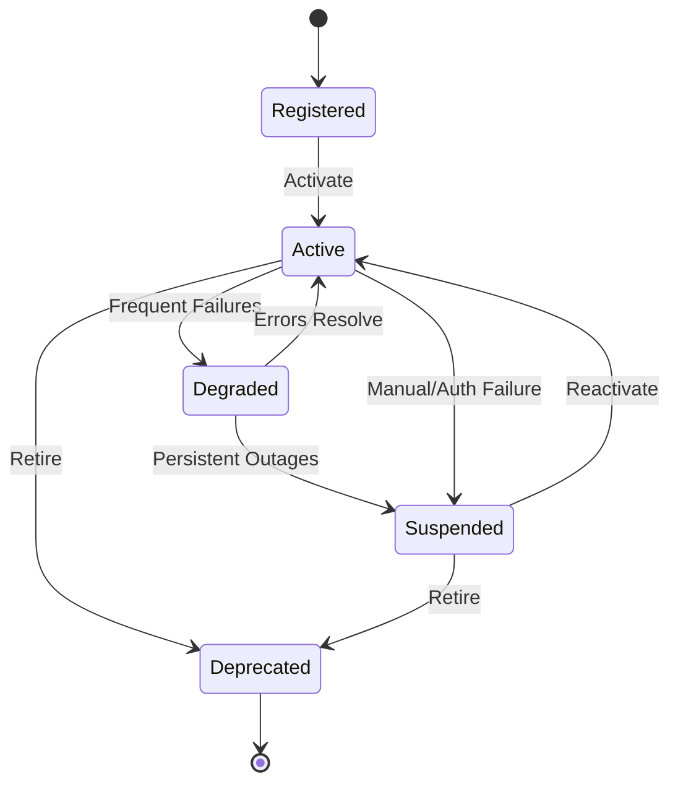

#### Relationships
- **Collector Jobs (1:N)**: A Source has one or more defined collection jobs.
- **Raw Documents (1:N)**: Ingested documents are stamped with the originating Source.
- **Credentials (1:N)**: A Source can map to multiple authentication payloads.
- **Source Configurations (1:N)**: A Source maintains a historical record of parser selectors and configuration parameters.

#### Business Rules
- A Source must have a valid `Source Type` (e.g., RSS, HTML Scrape, Social, API).
- Credentials must be encrypted using application-level AES-GCM before database insertion.
- The `Reliability Score` (0.00 to 1.00) is dynamically recalculated daily based on the ratio of successful fetches to total scheduled runs.

---

### 2.2 Collector Job

#### Purpose
A `Collector Job` defines the scheduling, execution parameters, retrieval limits, and parsing selectors used by ingestion engines to pull data from a specific `Source`.

#### Lifecycle
1. **Created**: The job parameters, extraction expressions, and cron schedule are saved.
2. **Scheduled**: The scheduler monitors the job's `next_run_at` timestamp.
3. **Running**: The ingestion worker has locked the job and is actively querying the external API or endpoint.
4. **Paused**: The job is temporarily suspended by administrative action. It does not transition to a scheduled state.
5. **Archived**: The job is soft-deleted. Run history is retained.

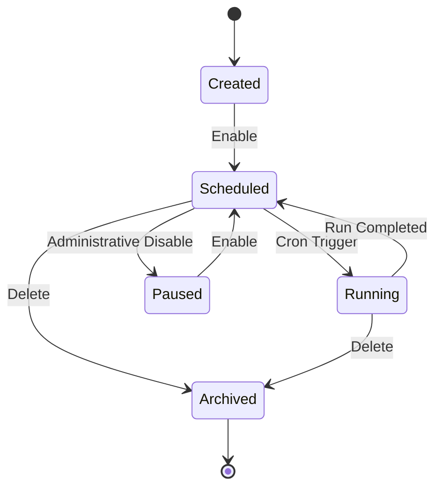

#### Relationships
- **Source (N:1)**: A Collector Job belongs to exactly one Source.
- **Schedules (1:N)**: A Job has one or more active schedules.
- **Job History (1:N)**: Every job execution spawns a history record tracking start, end, items fetched, and errors.

#### Business Rules
- No two executions of the same `Collector Job` may overlap. A lock mechanism must prevent a new instance from starting if a previous instance is still in the `Running` state.
- If a job fails, the retry mechanism must apply exponential backoff.
- The configuration data (e.g., JSON extraction paths) must be versioned. A running job always resolves the `is_current` version of the configuration.

---

### 2.3 Raw Document

#### Purpose
An immutable, byte-for-byte replica of content retrieved from a Source. This preserves data provenance and legal lineage.

#### Lifecycle
1. **Ingested**: The payload is stored in object storage (or database if small) and the hash is calculated.
2. **Pending Extraction**: The raw record exists, but parser workers have not yet processed it.
3. **Extracted**: The raw document has been successfully processed by parser pipelines to create a structured `Article`.
4. **Extraction Failed**: The parser was unable to structure the document due to bad selectors, formatting shifts, or corrupt payloads. It remains in this state until a parser configuration update triggers a re-run.

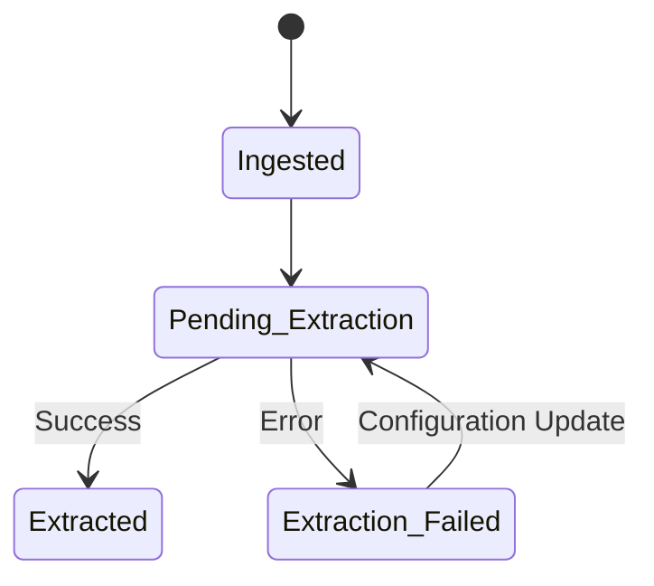

#### Relationships
- **Source (N:1)**: Records where the data came from.
- **Fetch Log (N:1)**: Identifies the specific job execution and network response that returned this payload.
- **Article (1:1)**: Once parsed, a Raw Document maps to exactly one normalized `Article` (if the payload is valid).

#### Business Rules
- **Immutability**: A Raw Document must never be edited, modified, or mutated under any circumstances.
- **Deduplication**: Prior to full extraction, the system checks the `content_hash` against existing active Raw Documents. If a duplicate is found, the raw payload is stored, but extraction is skipped, and a duplicate reference is linked.

---

### 2.4 Article

#### Purpose
The normalized, structured representation of an ingested document. Text formatting is stripped, metadata is normalized, and fields like `published_at`, `title`, and `content_plain` are parsed into a uniform schema.

#### Lifecycle
1. **Extracted**: The structured fields are created from the `Raw Document`.
2. **Pending Enrichment**: The text has been extracted, but down-stream services (AI classification, NER, keyword matching) have not run.
3. **Enriched**: Classification themes, entity mentions, and keyword hits have been resolved.
4. **Archived / Flagged**: The article is marked as deleted or excluded from search indexes, but preserved in the database for reference integrity.

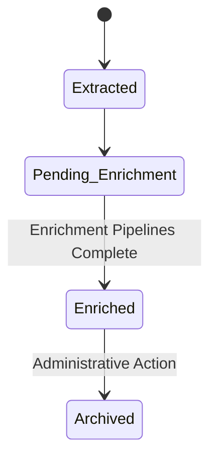

#### Relationships
- **Raw Document (1:1)**: Traces back to the raw payload.
- **Source (N:1)**: Originating publisher.
- **Authors (M:N)**: Map of byline names.
- **Events (M:N)**: An article may cover one or more real-world Events.
- **Entity Mentions (1:N)**: Resolves which entities are discussed in the text.
- **Classification Records (1:N)**: Links to taxonomy nodes.
- **Keyword Hits (1:N)**: Matches against monitored terms.

#### Business Rules
- Every Article must have a resolved `Language` and a computed `Canonical URL`.
- If an Article is updated at the source and re-fetched, the previous state is archived in a `document_version` record. The `Article` table itself only displays the current version.
- Articles identified as exact duplicates must be consolidated under a single `Canonical Document` reference.

---

### 2.5 Event

#### Purpose
A real-world occurrence, incident, or milestone. Events are independent semantic units that exist regardless of whether articles cover them. They compile information from multiple articles across different sources to provide a unified timeline.

#### Lifecycle
1. **Identified**: An event is created manually by analysts or automatically by correlation engines detecting a cluster of highly similar articles.
2. **Active / Ongoing**: The event is currently developing. New articles are continuously evaluated for correlation.
3. **Concluded**: The real-world occurrence is over (e.g., a festival has finished, a project is launched). New articles are no longer linked unless they represent post-incident analysis.
4. **Merged**: The event has been identified as a duplicate of another event. It is soft-deleted, and all article references are transferred to the target event.
5. **Archived**: Closed and no longer shown on real-time dashboards.

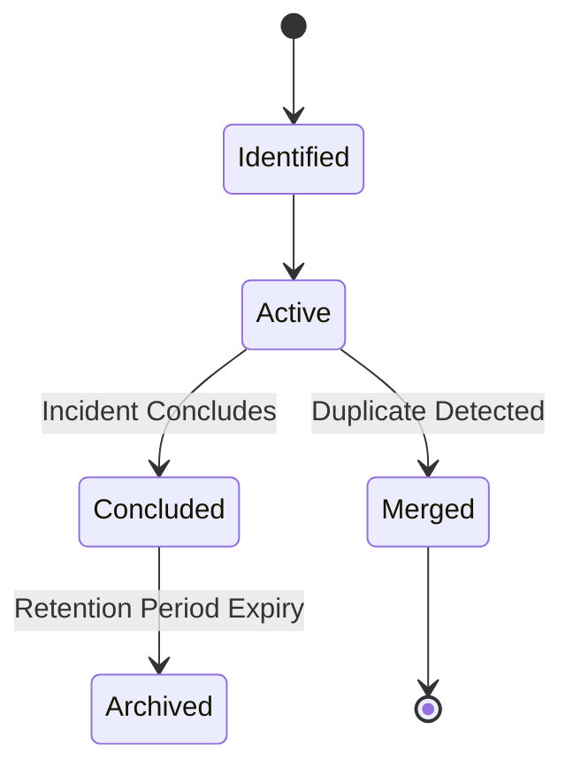

#### Relationships
- **Articles (M:N)**: Linked via `document_event` mapping tables.
- **Entities (M:N)**: Actors, locations, and organizations involved in the event.
- **Event Timeline Entries (1:N)**: Chronological developments within the event.
- **Event Relationships (M:N)**: directed graphs linking events (e.g., Cause-and-Effect).

#### Business Rules
- An Event must possess a `Severity` rating (1-5) and an `Event Type`.
- Merging an Event is a terminal operation. A record of the merge must be written to the `event_merge_history` table for tracking purposes.
- If the document count of an active event falls to zero (due to decoupling or deletion), the event state automatically reverts to `Identified` for evaluation.

---

### 2.6 Classification

#### Purpose
The classification records map an `Article` to specific `Taxonomy Nodes` using a verified `Classification Version` (a snapshot of taxonomy, AI models, and prompt structures).

#### Lifecycle
1. **Pending**: The article is queued for classification.
2. **Classified**: An AI model or rule engine has assigned taxonomy nodes and confidence scores.
3. **Validated**: An analyst has reviewed and approved the classification.
4. **Stale / Requeued**: The taxonomy or prompt version changed, requiring a regeneration.

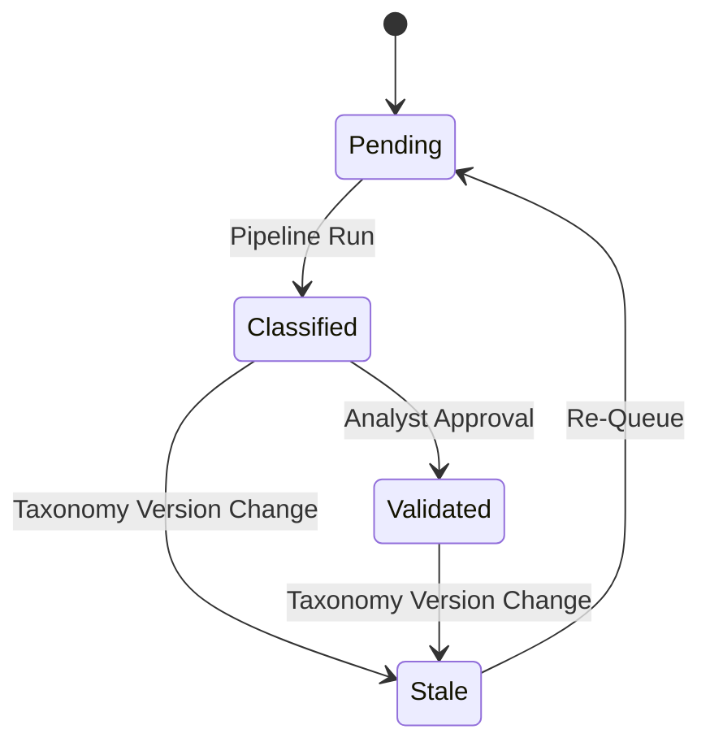

#### Relationships
- **Article (N:1)**: The classified document.
- **Taxonomy Node (N:1)**: The assigned category path.
- **Classification Version (N:1)**: The model/prompt configuration snapshot used.

#### Business Rules
- A classification must include a `Confidence Score` (0.0000 to 1.0000).
- If the confidence score is below a predefined threshold (e.g., 0.70), the validation status must remain `pending` to trigger manual review.
- If a classification record is manually updated by an analyst, it receives a validation status of `approved` and is exempted from automatic reclassification.

---

### 2.7 Taxonomy

#### Purpose
A hierarchically structured, versioned categorization tree. It standardizes the themes monitored by the platform.

#### Lifecycle
1. **Draft**: Taxonomy nodes and parent-child edges are being built.
2. **Current / Active**: The active version used by classification pipelines.
3. **Superseded**: A new version of the taxonomy has been promoted to `current`. Existing records remain linked to this historic version.
4. **Retired**: Disabled and no longer available for configuration.

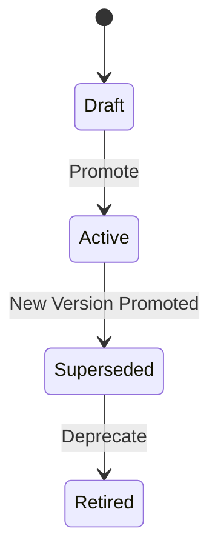

#### Relationships
- **Taxonomy Versions (1:N)**: Manages historical snapshots.
- **Taxonomy Nodes (1:N)**: Individual items in the tree.
- **Taxonomy Node Closure (M:N)**: An analytical self-join mapping ancestors to descendants to resolve tree depth queries.

#### Business Rules
- **Immutable Versions**: Once a `Taxonomy Version` is promoted to `Active`, it is permanently read-only. Any edits (adding nodes, changing names) require creating a new draft version.
- Only one version of a specific taxonomy can be `current` at a time.
- All nodes in a taxonomy must link back to a single root node.

---

### 2.8 Entity

#### Purpose
A unique real-world actor, organization, or location. Entities are resolved across different texts using canonical names and unique identifiers like Wikidata IDs.

#### Lifecycle
1. **Discovered**: An entity is extracted by NER engines, but not yet linked to the master registry.
2. **Verified / Canonical**: The entity is matched, deduplicated, and approved. It is now part of the global lookup directory.
3. **Merged**: The entity is determined to be a duplicate of another canonical entity (e.g., "U.P. Government" merged into "Government of Uttar Pradesh"). The record is preserved, but all alias links route to the target entity.
4. **Suspended / Hidden**: Administrative action hides the entity from filters, though it remains in the registry.

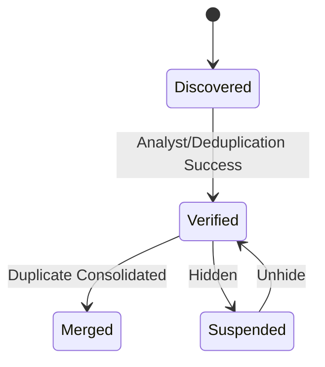

#### Relationships
- **Entity Type (N:1)**: Categorizes the entity (e.g., Person, Org, Location).
- **Entity Aliases (1:N)**: Alternative text representations.
- **Entity Mentions (1:N)**: Individual occurrences in articles.
- **Entity Relationships (M:N)**: Connections to other entities.

#### Business Rules
- Every Entity must possess a `Canonical Name` and an `Entity Type`.
- Disambiguation algorithms must output a matching score (0.0000 to 1.0000). Matches above the threshold (e.g., 0.90) are auto-linked; matches below are flagged for human validation.
- When two entities are merged, all historical `Entity Mentions` linked to the source entity must be updated to reference the target entity.

---

### 2.9 Keyword

#### Purpose
A tracking term or boolean phrase used to monitor topics in real-time.

#### Lifecycle
1. **Proposed**: Added by users or rules, waiting for system activation.
2. **Active**: Evaluated against incoming articles.
3. **Inactive**: Paused. No new matches are recorded.
4. **Deleted**: Soft-deleted from active processing.

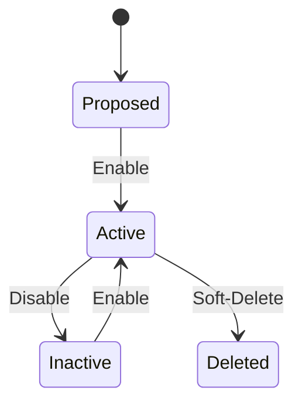

#### Relationships
- **Keyword Group (N:1)**: Belongs to a monitoring topic.
- **Keyword Hits (1:N)**: Captures occurrences within documents.
- **Language (N:1)**: Restricts evaluation to a specific language.

#### Business Rules
- Keywords support exact, partial, regex, and stemmed matching patterns.
- Keyword matching must run on the cleaned plain text of articles, never on raw HTML or markup.
- Negative keywords (exclusions) take precedence: if an article matches an active inclusion keyword but also contains a matching negative exclusion keyword in the same group, a keyword hit is not recorded.

---

### 2.10 User (Future)

#### Purpose
Represents human analysts, administrators, and external consumers of the platform.

#### Lifecycle
1. **Invited**: An account is provisioned but not activated.
2. **Active**: Enabled for login, actions, and administrative operations.
3. **Suspended**: Access temporarily disabled.
4. **Deactivated**: Permanently disabled.

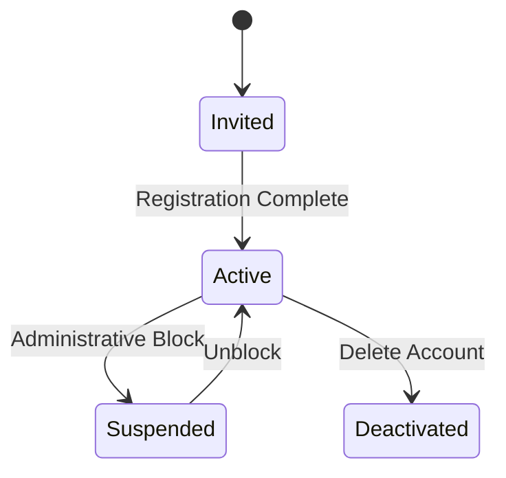

#### Relationships
- **Roles & Permissions (M:N)**: Maps users to security capabilities.
- **Bookmarks (1:N)**: Saved articles or events.
- **Alert Configurations (1:N)**: Personal alert rule preferences.
- **Audit Logs (1:N)**: Audit trail linking users to actions (e.g., validations, merges).

#### Business Rules
- All user modifications to documents, events, classifications, or entities must write an audit record with `user_id` and a timestamp.
- User passwords must never be stored in plain text. Multi-factor authentication must be supported at the domain level.
- Multi-tenancy scopes access; users can only view entities and sources belonging to their authorized tenant group.

---

### 2.11 Alert (Future)

#### Purpose
An automated notification dispatched when ingested data matches specified warning parameters.

#### Lifecycle
1. **Triggered**: Rule engines detect a condition match (e.g., severe event keyword match).
2. **Pending Dispatch**: The notification is created and queued for routing.
3. **Dispatched**: The notification is successfully sent to target channels (email, mobile push, SMS, webhook).
4. **Suppressed**: The alert was generated but blocked by rate limits or duplicate safety guards.
5. **Failed**: Delivery failed due to gateway timeouts or routing configuration issues.

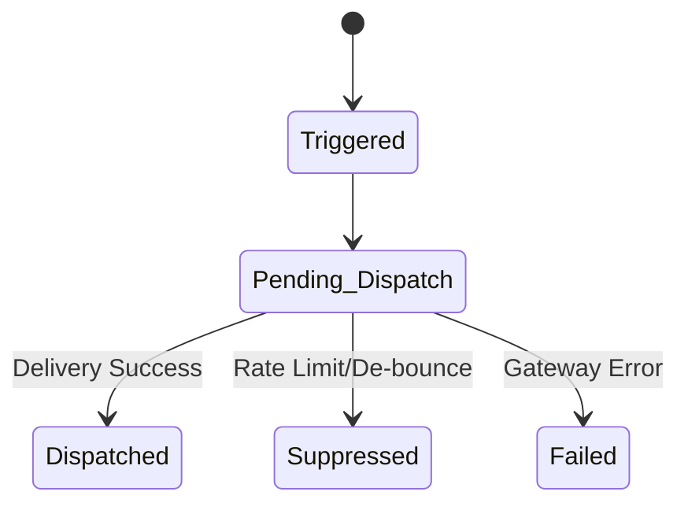

#### Relationships
- **Alert Rule (N:1)**: The logic configuration that triggered the alert.
- **Article / Event (N:1)**: The matching content that fired the rule.
- **User (M:N)**: Recipients of the notification.

#### Business Rules
- An alert rule must implement a "de-bounce" window. If the same rule matches multiple articles within a 5-minute window, it must consolidate those matches into a single notification.
- Severity levels (Info, Warning, Critical) determine the routing speed and dispatch path.
- Delivery failures must be retried up to three times with constant backoff before being marked as `Failed`.

---

## 3. Core Business Rules & Logical Reasoning

---

### Rule 3.1: Article to Event Cardinality
* **Rule**: Multiple articles can map to one Event. A single article can map to multiple Events.
* **Reasoning**: Real-world developments are complex. A government policy release (a single article) might simultaneously address "Clean River Initiatives" (Event A) and "Tourism Infrastructure Funding" (Event B). Forcing a 1:1 or N:1 constraint would break the network structure of event resolution.

---

### Rule 3.2: Entity Merging
* **Rule**: Entities can be merged at any point. Source entity records are preserved with a pointer redirection, and historical mentions are updated.
* **Reasoning**: Ingestion pipelines process massive feeds in real-time, often creating separate entity records for variations of the same name (e.g., "U.P. Chief Minister", "Yogi Adityanath", "CM Adityanath"). When disambiguation algorithms resolve these variations, the system must merge them without breaking the historic link to existing articles.

---

### Rule 3.3: Classification Regeneration
* **Rule**: Classifications can be regenerated whenever taxonomy versions change, AI prompts are modified, or validation parameters are updated.
* **Reasoning**: Machine learning models and classification prompts improve over time. If the underlying taxonomy structure changes (e.g., a node is split into two child nodes), historical documents must be reclassified to maintain analytical alignment.

---

### Rule 3.4: Raw Document Immutability
* **Rule**: Raw Documents must never be edited, modified, or redacted.
* **Reasoning**: If the platform's extraction engine logic contains a bug or is updated, the system must re-parse raw files. If raw files were modified, data lineage would be corrupted, and reprocessing would produce unreliable results.

---

### Rule 3.5: Article Deduplication and Merging
* **Rule**: Duplicate articles are not physically deleted. Instead, they are flagged as duplicates and linked to a single `Canonical Document`.
* **Reasoning**: If two news sites post the exact same wire agency story, it represents two separate ingestion occurrences but only one unique semantic unit. Preserving the duplicate records allows tracking which outlets carried the story while pointing analysts to a single text body for review.

---

### Rule 3.6: Event Closure
* **Rule**: An event transitions to "Concluded" when: (a) an analyst manually closes it, (b) its timeline definition contains a concluding marker, or (c) no new correlated articles are matched within a configurable rolling window (e.g., 7 days).
* **Reasoning**: Kumbh Monitor displays live intelligence. Concluding events keeps dashboards focused on active developments while keeping historic incidents accessible for query and analytics.

---

### Rule 3.7: Taxonomy Versioning
* **Rule**: Taxonomy versions are immutable once promoted to `Active`. Edits require creating a new draft version.
* **Reasoning**: Dynamic schema modification of active taxonomies would break existing classification rules and invalidate dashboard statistics. Versioning ensures that data remains consistent within a version period.

---

### Rule 3.8: Prompt Versioning
* **Rule**: AI prompt configurations are treated as system code. Every prompt variation must carry a version key, mapping outputs to the prompt used.
* **Reasoning**: In production AI systems, a slight prompt change can alter model output. Without strict prompt versioning, debugging classification drift or tracing why a document was tagged with a specific node becomes impossible.

---

### Rule 3.9: Article Reclassification Trigger
* **Rule**: Articles are reclassified only if: (a) a user manually requests it, (b) a new classification version is activated globally, or (c) the article was edited and generated a new `document_version` record.
* **Reasoning**: AI inference calls are expensive and add latency. The system must not reclassify documents during standard queries or minor metadata edits.

---

### Rule 3.10: Entity Reusability
* **Rule**: Entities must be decoupled from articles and stored in a shared global lookup.
* **Reasoning**: Storing entity definitions inline within documents would cause massive duplication and prevent relational queries (e.g., "Find all documents mentioning Person X"). Decoupled entities enable semantic search, graph exports, and network analysis.

---

## 4. Data Lifecycle: Ingestion to Archival

The platform processes information through a structured pipeline. Each phase transforms or enriches data, preserving lineage while building downstream structures.

```
                  ┌──────────────┐
                  │ 1. Source    │
                  └──────┬───────┘
                         │ Schedule Trigger
                  ┌──────▼───────┐
                  │ 2. Collection│
                  └──────┬───────┘
                         │ API/Fetch Worker
                  ┌──────▼───────┐
                  │ 3. Raw Doc   │
                  └──────┬───────┘
                         │ Extraction & Parse
                  ┌──────▼───────┐
                  │ 4. Article   │
                  └──────┬───────┘
                         │ Deduplication
                  ┌──────▼───────┐
                  │ 5. Canonical │
                  └──────┬───────┘
        ┌────────────────┼────────────────┐
        │ Enrichment     │ Enrichment     │ Enrichment
  ┌─────▼──────┐   ┌─────▼──────┐   ┌─────▼──────┐
  │ 6. Keyword │   │ 7. Entity  │   │ 8. Taxonomy│
  │    Hit     │   │  Extraction│   │  Classify  │
  └─────┬──────┘   └─────┬──────┘   └─────┬──────┘
        └────────────────┼────────────────┘
                         │ Event Resolution
                  ┌──────▼───────┐
                  │ 9. Event Link│
                  └──────┬───────┘
                         │ Storage & Indexes
                  ┌──────▼───────┐
                  │ 10. Query    │
                  └──────┬───────┘
                         │ Aggregations
                  ┌──────▼───────┐
                  │ 11. Analytics│
                  └──────┬───────┘
                         │ Retention Expiry
                  ┌──────▼───────┐
                  │ 12. Archive  │
                  └──────────────┘
```

### Ingestion to Archival Stages

---

#### 1. Source Configuration
The registry stores the targets for data collection. Active sources feed scheduled jobs.

---

#### 2. Collection
The scheduler issues ingestion instructions. Collector workers poll RSS feeds, fetch HTML files, or query APIs. This step records download statistics, response codes, and errors in execution logs.

---

#### 3. Raw Document Creation
The raw response payload is captured and saved as a byte stream in object storage. The SHA-256 hash is computed. If the hash matches an existing record, the pipeline flags the document as a duplicate and pauses processing. Otherwise, the payload proceeds to parser queues.

---

#### 4. Article Normalization
Extractors parse the raw payload, stripping scripts and CSS. Key metadata fields (title, byline, content body, publish date) are structured into the normalized document schema. A unique document ID is generated.

---

#### 5. Canonical URL Resolution & Near-Deduplication
The system evaluates the canonical URL and processes SimHash/MinHash fingerprints. If the article is identified as a near-duplicate, it is linked to the primary canonical article, and downstream enrichment runs on the canonical document.

---

#### 6. Keyword Evaluation
The article plain text is processed by a rule engine that matches keywords and boolean rules. Successful matches are written as keyword hit records with character offset positions.

---

#### 7. Entity Extraction & Disambiguation
Named Entity Recognition (NER) engines extract mentions of people, places, and organizations. The disambiguation service matches these mentions against the global entity dictionary. Confident matches link to existing entities; unresolved mentions flag the creation of proposed entities.

---

#### 8. Taxonomy Classification
The article text is processed using the active prompt and model configuration. The classification results, confidence scores, and supporting evidence are written to the database.

---

#### 9. Event Resolution
A correlation engine evaluates the enriched article. If it correlates with an active event, it is mapped to it. If it represents a new development, a new event is created.

---

#### 10. Indexing & Storage
The enriched article, events, and relationships are written to PostgreSQL. Database indexes (B-tree, GIN full-text, trigram) are updated, making the data searchable via platforms dashboards.

---

#### 11. Analytics Aggregation
Scheduled processes run queries against the operational tables to compute daily summaries, system usage metrics, and cost statistics. These statistics are saved to pre-aggregated analytics tables to power dashboards.

---

#### 12. Archival & Retention
After the retention period expires (e.g., 24 months for logs), raw partitions are detached from the database, exported to compressed files in object storage, and dropped from transactional databases.

---

## 5. Architectural Design Principles

To ensure the platform remains maintainable and extensible, every future module must adhere to these design principles:

### Principle 1: Never Lose Raw Data
Raw ingested content must be preserved in its original form. Parser logic and model prompts will evolve. Preserving raw data allows reprocessing historical records with updated algorithms.

### Principle 2: Complete Lineage Traceability
Every data point in the system must trace back to its origin. A dashboard metric must trace back to an entity relationship, which links to an article mention, which maps to a raw document, which connects to a fetch log and a source configuration.

### Principle 3: Immutable Configurations & Versioning
Any configuration that affects downstream data generation (taxonomy, rules, prompts, scraping layouts) must be versioned. Configurations cannot be updated in place; changes require spawning a new version.

### Principle 4: Reproducible AI Operations
Every LLM call must be logged with prompt version, parameters, inputs, and outputs. This records the logic behind automated decisions and allows reproducing the results for auditing.

### Principle 5: Decoupled Events & Entities
Events and entities exist independently of articles. Articles serve as supporting evidence. This separation ensures that merging events or entities does not corrupt historical article logs.

### Principle 6: Strict Audit Logging
Any state transition caused by manual analyst override (e.g., event merges, category overrides, entity adjustments) must write a log record linking to the user who made the change.

---

## 6. Appendix: Domain Object State Matrices

### State Transition Validation Rules

The following matrices define the valid transition paths for objects with state lifecycles. Any state change not explicitly listed here must be rejected by the domain layer.

#### Collector Job State Matrix
| Current State | Allowed Next States | Trigger |
|---|---|---|
| **Created** | Scheduled, Archived | Job enabled / deleted |
| **Scheduled** | Running, Paused, Archived | Scheduler trigger / disabled / deleted |
| **Running** | Scheduled, Archived | Job run finishes / deleted |
| **Paused** | Scheduled, Archived | Job enabled / deleted |
| **Archived** | None (Terminal) | — |

#### Event State Matrix
| Current State | Allowed Next States | Trigger |
|---|---|---|
| **Identified** | Active, Merged | Correlation engine match / duplicate merge |
| **Active** | Concluded, Merged, Archived | Incident finishes / duplicate merge / deletion |
| **Concluded** | Active, Archived | Re-opened on new reports / retention expiry |
| **Merged** | None (Terminal) | All article links transferred to target |
| **Archived** | Active | Restored by admin |

#### Classification Validation State Matrix
| Current State | Allowed Next States | Trigger |
|---|---|---|
| **Pending** | Classified | Parser runs classification |
| **Classified** | Validated, Stale | Analyst approval / taxonomy change |
| **Validated** | Stale | Taxonomy version update |
| **Stale** | Pending | Requeued for classification |

---

> **End of Domain Model Specification**  
> This document acts as the official domain blueprint for implementation. All system configurations, enrichment engines, and downstream pipelines must adhere to the lifecycles, business rules, and design principles established herein.
